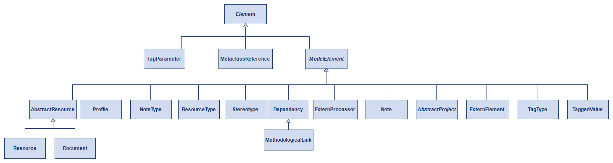
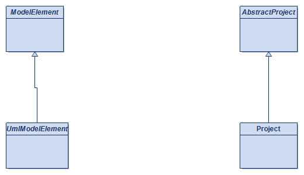

<style>
/* Redeclares the theme's footer-text box (content/font/color kept
   identical) but stretches it full-bleed so a top progress bar can be
   painted as a background layer behind the unchanged legal text.
   Progress width is set per-slide below via static rules (one per
   data-marpit-pagination value) rather than attr()-in-calc(), since
   typed attr() for non-content properties is only supported in very
   recent Chromium and isn't reliable for viewers opening slides.html
   directly. Regenerate the 65 rules below if the slide count changes. */
section::before {
    content: var(--doca-footer-text);
    position: absolute;
    top: 0;
    left: 0;
    right: 0;
    bottom: 0;
    display: flex;
    align-items: flex-end;
    justify-content: flex-end;
    padding: 0 60px 18px 0;
    font-family: 'Montserrat', 'Segoe UI', Arial, sans-serif;
    font-size: 11px;
    font-weight: 400;
    line-height: 1;
    color: var(--doca-gris-fonce);
    opacity: 0.85;
    letter-spacing: 0.01em;
    pointer-events: none;
    background-image: linear-gradient(to right, #0000FF, #1AA6A6, #0CFFC6, #FFCB05, #FF5657, #BF7CFF);
    background-repeat: no-repeat;
    background-size: 0% 6px;
    background-position: bottom left;
    filter: drop-shadow(0 0 6px rgba(191, 124, 255, 0.55));
}
section[data-marpit-pagination="1"]:not(.title):not(.closing):not(.section)::before { background-size: 1.5385% 6px; }
section[data-marpit-pagination="2"]:not(.title):not(.closing):not(.section)::before { background-size: 3.0769% 6px; }
section[data-marpit-pagination="3"]:not(.title):not(.closing):not(.section)::before { background-size: 4.6154% 6px; }
section[data-marpit-pagination="4"]:not(.title):not(.closing):not(.section)::before { background-size: 6.1538% 6px; }
section[data-marpit-pagination="5"]:not(.title):not(.closing):not(.section)::before { background-size: 7.6923% 6px; }
section[data-marpit-pagination="6"]:not(.title):not(.closing):not(.section)::before { background-size: 9.2308% 6px; }
section[data-marpit-pagination="7"]:not(.title):not(.closing):not(.section)::before { background-size: 10.7692% 6px; }
section[data-marpit-pagination="8"]:not(.title):not(.closing):not(.section)::before { background-size: 12.3077% 6px; }
section[data-marpit-pagination="9"]:not(.title):not(.closing):not(.section)::before { background-size: 13.8462% 6px; }
section[data-marpit-pagination="10"]:not(.title):not(.closing):not(.section)::before { background-size: 15.3846% 6px; }
section[data-marpit-pagination="11"]:not(.title):not(.closing):not(.section)::before { background-size: 16.9231% 6px; }
section[data-marpit-pagination="12"]:not(.title):not(.closing):not(.section)::before { background-size: 18.4615% 6px; }
section[data-marpit-pagination="13"]:not(.title):not(.closing):not(.section)::before { background-size: 20.0% 6px; }
section[data-marpit-pagination="14"]:not(.title):not(.closing):not(.section)::before { background-size: 21.5385% 6px; }
section[data-marpit-pagination="15"]:not(.title):not(.closing):not(.section)::before { background-size: 23.0769% 6px; }
section[data-marpit-pagination="16"]:not(.title):not(.closing):not(.section)::before { background-size: 24.6154% 6px; }
section[data-marpit-pagination="17"]:not(.title):not(.closing):not(.section)::before { background-size: 26.1538% 6px; }
section[data-marpit-pagination="18"]:not(.title):not(.closing):not(.section)::before { background-size: 27.6923% 6px; }
section[data-marpit-pagination="19"]:not(.title):not(.closing):not(.section)::before { background-size: 29.2308% 6px; }
section[data-marpit-pagination="20"]:not(.title):not(.closing):not(.section)::before { background-size: 30.7692% 6px; }
section[data-marpit-pagination="21"]:not(.title):not(.closing):not(.section)::before { background-size: 32.3077% 6px; }
section[data-marpit-pagination="22"]:not(.title):not(.closing):not(.section)::before { background-size: 33.8462% 6px; }
section[data-marpit-pagination="23"]:not(.title):not(.closing):not(.section)::before { background-size: 35.3846% 6px; }
section[data-marpit-pagination="24"]:not(.title):not(.closing):not(.section)::before { background-size: 36.9231% 6px; }
section[data-marpit-pagination="25"]:not(.title):not(.closing):not(.section)::before { background-size: 38.4615% 6px; }
section[data-marpit-pagination="26"]:not(.title):not(.closing):not(.section)::before { background-size: 40.0% 6px; }
section[data-marpit-pagination="27"]:not(.title):not(.closing):not(.section)::before { background-size: 41.5385% 6px; }
section[data-marpit-pagination="28"]:not(.title):not(.closing):not(.section)::before { background-size: 43.0769% 6px; }
section[data-marpit-pagination="29"]:not(.title):not(.closing):not(.section)::before { background-size: 44.6154% 6px; }
section[data-marpit-pagination="30"]:not(.title):not(.closing):not(.section)::before { background-size: 46.1538% 6px; }
section[data-marpit-pagination="31"]:not(.title):not(.closing):not(.section)::before { background-size: 47.6923% 6px; }
section[data-marpit-pagination="32"]:not(.title):not(.closing):not(.section)::before { background-size: 49.2308% 6px; }
section[data-marpit-pagination="33"]:not(.title):not(.closing):not(.section)::before { background-size: 50.7692% 6px; }
section[data-marpit-pagination="34"]:not(.title):not(.closing):not(.section)::before { background-size: 52.3077% 6px; }
section[data-marpit-pagination="35"]:not(.title):not(.closing):not(.section)::before { background-size: 53.8462% 6px; }
section[data-marpit-pagination="36"]:not(.title):not(.closing):not(.section)::before { background-size: 55.3846% 6px; }
section[data-marpit-pagination="37"]:not(.title):not(.closing):not(.section)::before { background-size: 56.9231% 6px; }
section[data-marpit-pagination="38"]:not(.title):not(.closing):not(.section)::before { background-size: 58.4615% 6px; }
section[data-marpit-pagination="39"]:not(.title):not(.closing):not(.section)::before { background-size: 60.0% 6px; }
section[data-marpit-pagination="40"]:not(.title):not(.closing):not(.section)::before { background-size: 61.5385% 6px; }
section[data-marpit-pagination="41"]:not(.title):not(.closing):not(.section)::before { background-size: 63.0769% 6px; }
section[data-marpit-pagination="42"]:not(.title):not(.closing):not(.section)::before { background-size: 64.6154% 6px; }
section[data-marpit-pagination="43"]:not(.title):not(.closing):not(.section)::before { background-size: 66.1538% 6px; }
section[data-marpit-pagination="44"]:not(.title):not(.closing):not(.section)::before { background-size: 67.6923% 6px; }
section[data-marpit-pagination="45"]:not(.title):not(.closing):not(.section)::before { background-size: 69.2308% 6px; }
section[data-marpit-pagination="46"]:not(.title):not(.closing):not(.section)::before { background-size: 70.7692% 6px; }
section[data-marpit-pagination="47"]:not(.title):not(.closing):not(.section)::before { background-size: 72.3077% 6px; }
section[data-marpit-pagination="48"]:not(.title):not(.closing):not(.section)::before { background-size: 73.8462% 6px; }
section[data-marpit-pagination="49"]:not(.title):not(.closing):not(.section)::before { background-size: 75.3846% 6px; }
section[data-marpit-pagination="50"]:not(.title):not(.closing):not(.section)::before { background-size: 76.9231% 6px; }
section[data-marpit-pagination="51"]:not(.title):not(.closing):not(.section)::before { background-size: 78.4615% 6px; }
section[data-marpit-pagination="52"]:not(.title):not(.closing):not(.section)::before { background-size: 80.0% 6px; }
section[data-marpit-pagination="53"]:not(.title):not(.closing):not(.section)::before { background-size: 81.5385% 6px; }
section[data-marpit-pagination="54"]:not(.title):not(.closing):not(.section)::before { background-size: 83.0769% 6px; }
section[data-marpit-pagination="55"]:not(.title):not(.closing):not(.section)::before { background-size: 84.6154% 6px; }
section[data-marpit-pagination="56"]:not(.title):not(.closing):not(.section)::before { background-size: 86.1538% 6px; }
section[data-marpit-pagination="57"]:not(.title):not(.closing):not(.section)::before { background-size: 87.6923% 6px; }
section[data-marpit-pagination="58"]:not(.title):not(.closing):not(.section)::before { background-size: 89.2308% 6px; }
section[data-marpit-pagination="59"]:not(.title):not(.closing):not(.section)::before { background-size: 90.7692% 6px; }
section[data-marpit-pagination="60"]:not(.title):not(.closing):not(.section)::before { background-size: 92.3077% 6px; }
section[data-marpit-pagination="61"]:not(.title):not(.closing):not(.section)::before { background-size: 93.8462% 6px; }
section[data-marpit-pagination="62"]:not(.title):not(.closing):not(.section)::before { background-size: 95.3846% 6px; }
section[data-marpit-pagination="63"]:not(.title):not(.closing):not(.section)::before { background-size: 96.9231% 6px; }
section[data-marpit-pagination="64"]:not(.title):not(.closing):not(.section)::before { background-size: 98.4615% 6px; }
section[data-marpit-pagination="65"]:not(.title):not(.closing):not(.section)::before { background-size: 100.0% 6px; }
</style>

<!-- _class: title -->

# Greffer SysML v2/KerML sur l'infrastructure Modelio
## Plan d'implémentation pour le package `implementation`

Juan Cadavid · 2026-08-21

---

# De quoi parle ce plan

<div class="box m">
Comment brancher le métamodèle KerML/SysML v2 sur l'infrastructure native de Modelio (<code>ModelElement</code>, <code>Note</code>, <code>Dependency</code>…) pour que SemGen puisse en générer un métamodèle Java valide — sans dupliquer ce que Modelio offre déjà, et sans casser la fidélité du package <code>reference</code>.
</div>

**Partie 1 · SysML v2 pour un œil UML** — le vocabulaire qui change (`def`/usage, `Feature`, `item`/`part`/`attribute`, specialization/subsetting/redefinition, occurrence/succession/flow, `Requirement`), avec exemples réels

**Partie 2 · Le point de greffe sur l'infrastructure Modelio** — le point de greffe est `ModelElement` ; le précédent UML de Modelio ; ce que ça change pour le nommage KerML

**Partie 3 · Chevauchements avec l'infrastructure Modelio** — trois cas concrets (`Comment`/`Documentation`, `Dependency`, métadonnées), exemples réels tirés de la spec OMG SysML v2, avec citations

**Partie 4 · Résoudre l'héritage multiple de KerML en Java** — 34 classes concernées ; approche recommandée et ses limites ; précédent MDE (EMF/Ecore), sources à l'appui

---

# Le package `reference` est terminé. `implementation` ne l'est pas.

<div class="two-col">
<div>

**`reference` — miroir fidèle de la spec**
- 182 classes, 209 généralisations, 351 associations
- Audité jusqu'à 0 écart par rapport au XMI normatif
- Hiérarchie autonome, sans lien avec l'infrastructure Modelio
- Reste intouché — c'est notre référence de fidélité, coquilles comprises

</div>
<div>

**`implementation` — la vraie cible**
- Même métamodèle, mais doit se brancher sur l'infrastructure Modelio
- Objectif : alimenter le module **SemGen** de Modelio pour générer un
  métamodèle JavaDesigner valide (code Java mm.api + mm.impl)
- Actuellement une copie de `reference` sans lien avec l'infrastructure —
  c'est exactement l'écart que ce plan doit combler

</div>
</div>

<div class="takeaway">Ce plan ne concerne que <strong>implementation</strong>. <strong>reference</strong> n'est pas touché.</div>

---

<!-- _class: "section theme-violet" -->

# Partie 1 · SysML v2 pour un œil UML

---

<!-- _class: dense -->

# SysML v2 pour un œil UML : le vocabulaire qui change

<div class="two-col">
<div>

**`def` / usage — la rupture principale**
- UML sépare déjà `Classifier`/`InstanceSpecification` — pas la nouveauté. La rupture : un `Property` UML (`wheels` sur `Car`) n'est qu'une feature typée, pas un `Classifier` — elle ne peut ni hériter ni se spécialiser pour son propre compte
- SysML v2 promeut chaque usage (`PartUsage`…) au rang de quasi-type : nom propre, sous-usages propres, peut spécialiser un autre usage — tout en restant typé par un `def`

**`Feature` — généralise `Property`**
- Chapeaute attribut, port, paramètre, association-end dans une seule notion unifiée (typage + multiplicité), réutilisée partout

</div>
<div>

**Trois relations à ne pas confondre**
- **Specialization** (`:`) : héritage classique, comme `Generalization` en UML
- **Subsetting** (`:>`) : un feature restreint l'ensemble de valeurs d'un feature plus général — pas d'équivalent UML direct, proche d'une contrainte de sous-ensemble
- **Redefinition** (`:>>`) : un feature hérité est remplacé par un feature plus spécifique dans un contexte usage — proche de `redefinedProperty` UML, mais généralisé à tout `Feature`

**Occurrence, Succession, Flow**
- `Occurrence` : quelque chose qui existe dans le temps (remplace/étend la notion d'instance UML)
- `Succession` / `Flow` : ordonnancement et échange entre occurrences — équivalent enrichi des `ControlFlow`/`ObjectFlow` UML/SysML v1

</div>
</div>

<div class="takeaway">Point clé pour la suite : chaque case des 34 cas d'héritage multiple oppose l'axe <strong>Definition/Usage</strong> à un axe UML plus classique (<code>Classifier</code>, <code>Relationship</code>, <code>Feature</code>…).</div>

---

<!-- _class: dense -->

# Exemple · `def` / usage

<p style="font-size:0.6em;color:#888;">Source : SysML v2.0, §7.6.1 « Definition and Usage Overview »</p>

<div class="two-col">
<div>

**Le `def`, réutilisable — comme une `Class` UML**
```
part def Vehicle {
    part wheels[4..8];
    attribute mass : Real default 1500.0;
}
```

**Le usage, une occurrence typée**
```
part vehicle : Vehicle;
```

</div>
<div>

**Ce qu'un `Classifier` UML ne capture pas**
- `vehicle` n'est pas juste « une instance » : c'est lui-même un élément du modèle, avec son propre nom, sa propre hiérarchie de sous-usages, et il peut être spécialisé à son tour
- Un `def` peut spécialiser un autre `def` (`Truck :> Vehicle`) ; un usage peut spécialiser un autre usage — les deux hiérarchies restent parallèles et distinctes

</div>
</div>

<div class="takeaway"><code>Vehicle</code> est un <code>def</code> ; <code>vehicle</code> est un usage typé par <code>Vehicle</code> — deux éléments, deux hiérarchies d'héritage possibles.</div>

---

<!-- _class: dense -->

# Exemple · `Feature`

<p style="font-size:0.6em;color:#888;">Source : SysML v2.0, §7.6.1 « Definition and Usage Overview » (exemple <code>Vehicle</code>/<code>wheels</code>) et §7.13.3 (exemple <code>mass</code>)</p>

<div class="two-col">
<div>

```
part def Vehicle {
    part wheels[4..8];
    attribute mass : Real default 1500.0;
}
```

- `wheels` est un feature de type `part`, avec sa multiplicité `[4..8]`
- `mass` est un feature de type `attribute`, typé par `Real`, avec une valeur par défaut

</div>
<div>

**Une seule notion pour tout ce qu'UML sépare**
- Attribut (`attribute`), port (`port`), paramètre (`in`/`out`), extrémité d'association — tous des `Feature` en KerML, avec la même mécanique de typage, multiplicité, subsetting et redéfinition
- En UML, `Property` couvre déjà attribut + association-end, mais pas port ni paramètre de la même façon — `Feature` unifie tout ça une seule fois, à un seul niveau

</div>
</div>

<div class="takeaway"><code>Feature</code> = tout ce qu'un élément possède et qui se type, se compte et se redéfinit — attribut, port, paramètre, extrémité de relation, tout y passe.</div>

---

<!-- _class: dense -->

# `item`, `part`, `attribute` : lequel utiliser ?

<p style="font-size:0.6em;color:#888;">Source : SysML v2.0, §7.10.1 « Items Overview », §7.10.2 (exemple <code>Fuel</code>), §7.11.1 « Parts Overview »</p>

<div class="two-col">
<div>

**La question à se poser : est-ce une donnée, ou une chose qui existe dans le temps ?**
- **`attribute`** : une valeur de données (nombre, quantité, texte) — n'a pas d'identité propre, ne peut pas être « connectée » ni « détruite »
- **`item`** : une chose identifiable qui peut être agie sur dans le temps (matière, signal, donnée qui circule) — mais qui n'agit pas forcément elle-même
- **`part`** : un `item` qui, en plus, peut lui-même effectuer des actions (comportement propre) — <strong>tout `part` est un `item`, l'inverse est faux</strong>

```
item def Fuel {
    attribute pressure : PressureValue;
    ref item impurities[0..*] : Material;
}
```

</div>
<div>

**Pourquoi `wheels` est un `part` et `mass` un `attribute`**
- `wheels` a une existence physique propre : on peut la connecter, la remplacer, elle a un cycle de vie — c'est une occurrence structurelle → `part`
- `mass` est juste une valeur numérique portée par `vehicle` : elle n'a pas d'identité indépendante, seulement une valeur qui peut changer → `attribute`

**Le même « Fuel » peut être les deux selon le rôle**
- Le spec le dit explicitement : le carburant qui circule est un `item` (`item def Fuel`) ; un moteur en cours d'assemblage est un `item` sur la chaîne, mais devient un `part` une fois monté dans le véhicule — le même objet change de rôle, pas de nature

</div>
</div>

<div class="takeaway">Donnée sans identité → <code>attribute</code> · chose qui circule/existe → <code>item</code> · chose qui agit elle-même → <code>part</code> (qui est toujours aussi un <code>item</code>).</div>

---

<!-- _class: dense -->

# Exemple · Specialization, Subsetting, Redefinition

<p style="font-size:0.6em;color:#888;">Source : SysML v2.0, §7.6.1 (Vehicle/Truck), §7.6.3 (syntaxe et équivalence symbole/mot-clé), §7.7 (Person/mother)</p>

<div class="box y">
Piège : <code>:></code> a <strong>deux sens</strong> — entre deux <code>def</code>, il abrège <code>specializes</code> (hérite tout) ; sur un feature d'usage, il abrège <code>subsets</code> (restreint). Même symbole, deux emplois.
</div>

<div class="two-col">
<div>

**Specialization — entre deux `def`, `:>` = `specializes`**
```
part def Truck :> Vehicle;
```
`Truck` hérite `wheels[4..8]` et `mass` tels quels — comme une `Generalization` UML.

**Subsetting — sur un feature, `:>` = `subsets`**
```
item def Person {
    ref item parent[2] : Person;
    ref item mother : Person[1..1] :> parent;
}
```

</div>
<div>

**Redefinition — `:>>` = `redefines`**
```
part def Engine {
    part cylinders : Cylinder[2..*];
}
part def FourCylinderEngine :> Engine {
    part :>> cylinders[4];
}
```
`FourCylinderEngine` hérite `cylinders`, mais le remplace par une version plus contrainte (`[4]` au lieu de `[2..*]`).

**UML ne généralise pas ce mécanisme** : `redefinedProperty` n'existe que pour `Property` ; `:>>` marche pour tout `Feature` (part, port, action…).

</div>
</div>

<div class="takeaway">Entre deux <code>def</code> : <code>:></code> = <code>specializes</code>. Sur un feature : <code>:></code> = <code>subsets</code>, <code>:>></code> = <code>redefines</code>.</div>

---

<!-- _class: dense -->

# Exemple · Occurrence, Succession, Flow

<p style="font-size:0.6em;color:#888;">Source : SysML v2.0, §7.6.6 « Feature Chains » ; Cas 3 (<code>Connector</code>), Cas 4 (<code>Flow</code>), Cas 7 (<code>SuccessionFlow</code>) plus loin dans ce plan</p>

<div class="two-col">
<div>

**Occurrence — une chose qui existe dans le temps**
- `vehicle`, `wheelAssembly`, `wheels` sont chacun des occurrences : ils peuvent être créés, connectés, détruits — pas juste des valeurs statiques comme une `InstanceSpecification` UML

**Connexion entre occurrences**
```
connect vehicle.wheelAssembly.wheels
    to vehicle.road;
```

</div>
<div>

**Succession et Flow — ordonner et faire circuler**
```
succession flow focus.image
    to shoot.image;
```
- `Succession` : « ceci se termine avant que cela commence » — enrichit `ControlFlow` UML
- `Flow` : transfert d'un item d'une occurrence à une autre — enrichit `ObjectFlow` UML
- Les deux combinés (`succession flow`) : l'ordre ET le transfert en une seule relation

</div>
</div>

<div class="takeaway">Une occurrence est une chose qui existe et évolue ; succession l'ordonne, flow fait circuler quelque chose entre occurrences.</div>

---

<!-- _class: dense -->

# `Requirement` — un pilier SysML sans équivalent UML natif

<p style="font-size:0.6em;color:#888;">Source : SysML v2.0, §7.21.1 « Requirements Overview », §7.21.2 (exemple <code>BrakingRequirement</code>)</p>

<div class="two-col">
<div>

**Une exigence est un `def`/usage comme les autres**
```
requirement def BrakingRequirement {
    subject vehicle : Vehicle;
    actor environment : 'Driving Environment';
    stakeholder driver : Person;

    attribute speedLimit : SpeedValue;

    assume constraint {
        doc /* Les conditions
        environnementales sont mauvaises. */
    }
}
```

</div>
<div>

**Pourquoi UML n'a rien d'équivalent**
- UML n'a pas de notion native de « sujet », « acteur » ou « partie prenante » d'une exigence — au mieux, un profil SysML v1 ajouté par-dessus
- `RequirementUsage` porte cette structure nativement (attributs `reqId`, `text`, `subject`, `actor`, `stakeholder`) et se compose avec le reste du modèle comme n'importe quel usage
- Une exigence peut être satisfaite par un usage concret : `satisfy requirement braking : BrakingRequirement by vehicle1;` (revu au Cas 32, `SatisfyRequirementUsage`)

</div>
</div>

<div class="takeaway">Ce concept réapparaît plus loin (Cas 32) sans être ré-expliqué — à garder en tête : une exigence est structurée nativement, pas juste annotée.</div>

---

<!-- _class: "section theme-mint" -->

# Partie 2 · Le point de greffe sur l'infrastructure Modelio

---

<!-- _class: dense -->

# Résolu : le point de greffe est ModelElement

<div class="box m">
<strong>Confirmé</strong> par l'inspection directe du métamodèle d'infrastructure Modelio (19 classes, package <code>infrastructure</code>) : <code>Element</code> est la racine ultime, abstraite, de Modelio. <code>ModelElement</code> en est un sous-type direct. Et surtout : <strong>16 des 17 autres classes d'infrastructure étendent ModelElement, aucune n'étend Element directement.</strong>
</div>



<span class="chip">Les 19 classes du package infrastructure</span> — vue complète, aucune omise.

---

<!-- _class: dense -->

# Le précédent le plus pertinent : l'implémentation UML de Modelio

<div class="box m">
SysML/KerML est structurellement bien plus proche d'UML que de tout autre métamodèle Modelio. Modelio a sa propre implémentation d'UML (package <code>standard</code>), avec sa propre greffe sur l'infrastructure.
</div>



<div class="takeaway"><code>UmlModelElement -> ModelElement</code> et <code>Project (UML) -> AbstractProject</code> — pas un cas isolé. <strong>AbstractProject</strong> a des sous-types directs à travers plusieurs métamodèles Modelio chargés (UML, Impact, Review, Analyst, Module) : c'est la convention établie, pas une exception.</div>

---

<!-- _class: dense -->

# Ce que ça change pour la greffe — et pour le nommage

<div class="two-col">
<div>

**Le point de greffe**
- Renommer, dans `implementation` uniquement, la classe `Element`
  de KerML en `KerMLModelElement`
- Faire étendre `KerMLModelElement extends ModelElement`
  directement

</div>
<div>

**Le point de projet**
- Introduire `SysMLProject extends AbstractProject`, sur le même
  patron que `Project` (UML)
- Nommé côté SysML, pas KerML : il n'y aura pas d'éditeur KerML
  autonome, seulement un éditeur SysML v2 — KerML reste la couche
  fondationnelle greffée en interne, mais n'a pas sa propre
  surface de projet

</div>
</div>

<div class="takeaway">UML lui-même a un concept natif « Element » (racine du métamodèle OMG UML). Modelio le renomme directement en <code>UmlModelElement</code>, sans couche d'indirection. Même geste pour KerML : renommer directement.</div>

---

<!-- _class: "section theme-poussin" -->

# Partie 3 · Chevauchements avec l'infrastructure Modelio

---

<!-- _class: dense -->

# Trois chevauchements concrets entre KerML et l'infrastructure

<div class="box y">
Recensement fait à partir des 182 classes de <code>reference</code> comparées aux 19 classes d'infrastructure Modelio, texte de spec à l'appui. Le principe est simple : ne pas réimplémenter dans <strong>implementation</strong> ce que l'infrastructure fait déjà nativement — trois candidats concrets, détaillés sur les slides suivantes.
</div>

| Concept KerML | Infrastructure Modelio | Nature du chevauchement |
|---------------|-------------------------|----------------------------|
| `Comment`, `Documentation` | `Note` | Même rôle : annoter un élément avec du texte libre |
| `Dependency` | `Dependency` | **Collision de nom ET de concept** |
| `MetadataDefinition`/`MetadataUsage` | `Stereotype` + `TaggedValue` | Même rôle architectural : métadonnées typées attachées à un élément |

---

<!-- _class: dense -->

# Chevauchement 1a · `Comment` ↔ `Note`

<p style="font-size:0.6em;color:#888;margin:0 0 6px 0;">Source : OMG SysML v2.0 Part 1 (formal/2025-09-01), clause 7.4.2 "Comments and Documentation", p.21-22</p>

<div class="box m">
<code>Comment</code> (sous-type d'<code>AnnotatingElement</code>) : « whose body in some way describes its annotatedElements. » Un attribut porteur : <code>body : String [1..1]</code>, plus <code>locale</code> optionnel.
</div>

<div class="two-col">
<div>

**Forme explicite, avec cible nommée**
```
item A;
part B;
comment Comment1 about A, B
    /* This is the comment
    body text. */
```

</div>
<div>

**Forme implicite (membre d'un package) et avec locale**
```
package P {
    comment C /* This is a
    comment about P. */
}

comment C_US_English
    locale "en_US"
    /* This is US English
    comment text */
```

</div>
</div>

<div class="takeaway">Trois formes, un seul besoin : texte libre attaché à un élément, avec ou sans cible explicite, avec ou sans langue. <code>Note</code> de Modelio couvre déjà tout ce rôle.</div>

---

<!-- _class: dense -->

# Chevauchement 1b · `Documentation` ↔ `Note`

<p style="font-size:0.6em;color:#888;margin:0 0 6px 0;">Source : OMG SysML v2.0 Part 1 (formal/2025-09-01), clause 7.4.2 "Comments and Documentation", p.22</p>

<div class="box m">
<code>Documentation</code> (sous-type de <code>Comment</code>, aucun attribut propre) : « specifically documents a documentedElement, which must be its owner. » Spécialisation par <strong>contrainte</strong> (l'élément documenté doit être le propriétaire), pas par structure.
</div>

```
part X {
    doc X_Comment
        /* This is a documentation comment about X. */
    doc /* This is more documentation about X. */
}
```

<div class="takeaway">Même syntaxe que <code>comment</code>, mot-clé <code>doc</code> à la place — l'élément documenté est toujours le propriétaire, jamais besoin d'un <code>about</code> explicite. Aucune nouvelle classe à créer dans <strong>implementation</strong> : <code>Comment</code> et <code>Documentation</code> se mappent sur <code>Note</code>.</div>

---

<!-- _class: dense -->

# Chevauchement 2 · `Dependency` ↔ `Dependency`

<p style="font-size:0.6em;color:#888;margin:0 0 6px 0;">Source : OMG SysML v2.0 Part 1 (formal/2025-09-01), clause 7.3.2 "Dependency Declaration", p.18-19</p>

<div class="box y">
Collision de <strong>nom ET de concept</strong> — le seul des trois cas où les deux définitions se lisent presque mot pour mot de la même façon.
</div>

**`Dependency`** (sous-type de `Relationship`, aucun attribut propre) : « indicates that one or more client Elements require one or more supplier Elements for their complete specification. »

```
dependency Use
    from 'Application Layer' to 'Service Layer';

// forme non nommée, n-aire :
dependency 'Service Layer' to 'Data Layer', 'External Interface Layer';
```

<div class="takeaway">Aucune structure propre à réconcilier — c'est le cas le plus net des trois. <code>Dependency</code> de KerML devrait être un alias direct de <code>Dependency</code> de Modelio.</div>

---

<!-- _class: dense -->

# Chevauchement 3a · `MetadataDefinition` ↔ `Stereotype`

<p style="font-size:0.6em;color:#888;margin:0 0 6px 0;">Source : OMG SysML v2.0 Part 1 (formal/2025-09-01), clause 7.27.2 "Metadata Definitions and Usages", p.159</p>

<div class="box m">
<code>MetadataDefinition</code> (<code>ItemDefinition</code> <strong>et</strong> <code>Metaclass</code>) : « an ItemDefinition that is also a Metaclass » — définit le <em>type</em> des métadonnées, comme un <code>Stereotype</code> définit le type d'une extension.
</div>

**Déclarée comme une définition d'item, avec le mot-clé `metadata def` :**

```
metadata def SecurityRelated;

metadata def ApprovalAnnotation {
    attribute approved : Boolean;
    attribute approver : String;
}
```

<div class="takeaway">Une définition vide (marqueur pur) ou porteuse d'attributs typés — exactement ce qu'un <code>Stereotype</code> Modelio fait déjà, avec ses <code>TagType</code> pour chaque attribut.</div>

---

<!-- _class: dense -->

# Chevauchement 3b · `MetadataUsage` ↔ `TaggedValue`

<p style="font-size:0.6em;color:#888;margin:0 0 6px 0;">Source : OMG SysML v2.0 Part 1 (formal/2025-09-01), clause 7.27.2 "Metadata Definitions and Usages", p.159-160</p>

<div class="two-col">
<div>

**Explicite, avec cible(s) et valeurs**
```
metadata securityDesignAnnotation
    : SecurityRelated
    about SecurityRequirements,
          SecurityDesign;

metadata ApprovalAnnotation
    about Design {
    ref :>> approved = true;
    ref :>> approver = "John Smith";
}
```

</div>
<div>

**Raccourcis : `ref`/`redefines` implicite, cible implicite, symbole `@`**
```
metadata ApprovalAnnotation
    about Design {
    approved = true;
    approver = "John Smith";
}

part def Design {
    // implicitement about Design
    @ApprovalAnnotation {
        approved = true;
        approver = "John Smith";
    }
}
```

</div>
</div>

<div class="takeaway">C'est le chevauchement le plus <strong>architecturalement significatif</strong> des trois — pas une seule classe, tout un sous-système à ne pas dupliquer dans <strong>implementation</strong>.</div>

---

<!-- _class: "section theme-mint" -->

# Partie 4 · Résoudre l'héritage multiple de KerML en Java

---

<!-- _class: dense -->

# Java n'a pas d'héritage multiple — KerML, si : 34 classes concernées

<div class="box y">
Java 17 : une classe peut <strong>implémenter</strong> plusieurs interfaces, mais ne peut <strong>étendre</strong> qu'une seule classe. Recensement complet sur le package <code>reference</code> (182 classes) : <strong>34 classes ont 2 super-types directs</strong> — de vraies généralisations <strong>orthogonales</strong>, pas des diamants (une, <code>FlowUsage</code>, en a même 3).
</div>

<div class="two-col">
<div>

`ActionDefinition` → OccurrenceDefinition, Behavior
`ActionUsage` → OccurrenceUsage, Step
`AssertConstraintUsage` → ConstraintUsage, Invariant
`Association` → Relationship, Classifier
`AssociationStructure` → Structure, Association
`AttributeDefinition` → Definition, DataType
`BindingConnectorAsUsage` → ConnectorAsUsage, BindingConnector
`CalculationDefinition` → ActionDefinition, Function
`CalculationUsage` → ActionUsage, Expression
`ConnectionDefinition` → PartDefinition, AssociationStructure
`ConnectionUsage` → PartUsage, ConnectorAsUsage
`Connector` → Relationship, Feature
`ConnectorAsUsage` → Usage, Connector
`ConstraintDefinition` → OccurrenceDefinition, Predicate
`ConstraintUsage` → OccurrenceUsage, BooleanExpression
`ExhibitStateUsage` → PerformActionUsage, StateUsage
`Flow` → Connector, Step

</div>
<div>

`FlowDefinition` → ActionDefinition, Interaction
`FlowUsage` → ConnectorAsUsage, ActionUsage, Flow **(3 parents)**
`IncludeUseCaseUsage` → PerformActionUsage, UseCaseUsage
`Interaction` → Association, Behavior
`ItemDefinition` → OccurrenceDefinition, Structure
`MembershipExpose` → Expose, MembershipImport
`MetadataDefinition` → ItemDefinition, Metaclass
`MetadataFeature` → AnnotatingElement, Feature
`MetadataUsage` → ItemUsage, MetadataFeature
`NamespaceExpose` → Expose, NamespaceImport
`OccurrenceDefinition` → Definition, Class
`PerformActionUsage` → EventOccurrenceUsage, ActionUsage
`PortDefinition` → OccurrenceDefinition, Structure
`SatisfyRequirementUsage` → AssertConstraintUsage, RequirementUsage
`SuccessionAsUsage` → ConnectorAsUsage, Succession
`SuccessionFlow` → Succession, Flow
`SuccessionFlowUsage` → FlowUsage, SuccessionFlow

</div>
</div>

---

<!-- _class: dense -->

# Approche recommandée : axe primaire + interface déléguée

<div class="box m">
Retenue face à « décider au cas par cas » et « dupliquer l'état », écartées pour manque de cohérence/réutilisation : l'axe qui appartient à la lignée <strong>Definition/Usage</strong> gagne toujours <code>extends</code> ; l'autre axe devient une interface <code>mm.api</code>, implémentée par délégation à un petit objet interne qui porte son état.
</div>

<div class="two-col">
<div>

**Pourquoi Definition/Usage prime**
- C'est l'axe organisateur de tout SysML : chaque concept que l'utilisateur écrit est soit un `def`, soit un usage — pas une variante parmi d'autres
- Il porte la mécanique structurelle lourde partout réutilisée : possession (une Definition possède ses Usages), typage, redéfinition (`:>>`) — qui a besoin d'un vrai héritage Java, pas d'un simple contrat
- L'axe secondaire (DataType, Behavior, Structure…) ajoute un rôle sémantique ponctuel, pas la colonne vertébrale par laquelle le modèle est navigué

</div>
<div>

**`AttributeDefinition -> Definition, DataType`**
```java
interface AttributeDefinition
    extends Definition, DataType { }   // mm.api

class AttributeDefinitionImpl
    extends DefinitionImpl             // mm.impl
    implements AttributeDefinition {
    private DataTypeBehavior dataType; // délégué
    public /* DataType */ ... { return dataType.xxx(); }
}
```

</div>
</div>

<div class="takeaway"><code>Definition</code> gagne <code>extends</code> car c'est l'axe structurel ; <code>DataType</code> devient une interface déléguée car c'est un rôle transversal.</div>

---

<!-- _class: dense -->

# Les 34 cas, un par un

<div class="box y">
Pour chacun : la description du concept et de ses super-types (extraite de la spec, via les Notes du modèle <code>reference</code>), son chemin qualifié, ce qu'il hérite de chaque parent (attributs, opérations, comportement), puis la résolution — quel super-type gagne <code>extends</code>, lequel devient une interface <code>mm.api</code> déléguée.
</div>

<div class="box m">
Rappel Java : <code>implements</code> ne s'applique qu'à des interfaces. Ça tient ici parce que <strong>chaque concept KerML génère à la fois une interface</strong> (<code>Association</code>, <code>DataType</code>…) <strong>et sa classe d'implémentation</strong> (<code>AssociationImpl</code>…) — voir la slide « Approche recommandée ». Sur les 34 slides suivantes, <code>implements X</code> vise toujours l'interface <code>X</code>, jamais une classe.
</div>

<div class="takeaway">34 slides suivent, une par cas — même format, même logique de décision. Chemins qualifiés abrégés (préfixe <code>modelio.sysml2::reference::</code> omis). Ordre : d'abord les <strong>7 cas KerML</strong> (cas 1-7 — le noyau, sur lequel SysML se construit), puis les <strong>27 cas SysML</strong> (cas 8-34).</div>

---

<!-- _class: dense -->

# Cas 1 · `Association`

<div class="two-col">
<div>

**Classe : `Association`** *(KerML::Kernel::Associations)* — Relationship et Classifier, pour classifier des liens entre choses.

**Exemple (syntaxe SysML v2/KerML) :**
```
assoc Ownership { end owner[1]:LegalEntity; end ownedAsset[1]:Asset; }
```

**Super-type primaire : `Relationship`** *(KerML::Root::Elements)* — Element qui relie d'autres Elements. Hérite : attribut `isImplied` ; opérations `libraryNamespace`, `path`.

**Super-type secondaire : `Classifier`** *(KerML::Core::Classifiers)* — Type qui classifie des choses ou leurs relations via Features.

</div>
<div>

<div class="box y">Ni <code>Relationship</code> ni <code>Classifier</code> n'appartient à la lignée Definition/Usage — deux concepts-noyau à égalité.</div>

<div class="takeaway"><code>extends Relationship</code> ; <code>implements Classifier</code>, délégué — l'identité première d'une association est de relier des éléments.</div>

```java
interface Association extends Relationship, Classifier { }  // mm.api
```

```java
class AssociationImpl
    extends RelationshipImpl
    implements Classifier { ... }  // mm.impl
```

</div>
</div>

---

<!-- _class: dense -->

# Cas 2 · `AssociationStructure`

<div class="two-col">
<div>

**Classe : `AssociationStructure`** *(KerML::Kernel::Associations)* — Association qui est aussi une Structure, classifiant des objets-liens.

**Exemple (syntaxe SysML v2/KerML) :**
```
assoc struct ExtendedAssetOwnership { end feature owner:LegalEntity crosses ownedAsset.owningEntities; }
```

**Super-type primaire : `Association`** *(KerML::Kernel::Associations)* — déjà résolu au cas 1 — hérite : état de `Relationship` (`isImplied`) + rôle `Classifier` délégué.

**Super-type secondaire : `Structure`** *(KerML::Kernel::Structures)* — Class d'objets principalement structurels dans l'univers modélisé.

</div>
<div>

<div class="box y">Correction : <code>Association</code> a déjà un état réel (cas 1) — elle ne peut pas redevenir secondaire ici. C'est elle qui gagne <code>extends</code>.</div>

<div class="takeaway"><code>extends Association</code> ; <code>implements Structure</code>, délégué — état réel déjà hérité (cas 1) — Association ne peut pas redevenir secondaire ici.</div>

```java
interface AssociationStructure extends Association, Structure { }  // mm.api
```

```java
class AssociationStructureImpl
    extends AssociationImpl
    implements Structure { ... }  // mm.impl
```

</div>
</div>

---

<!-- _class: dense -->

# Cas 3 · `Connector`

<div class="two-col">
<div>

**Classe : `Connector`** *(KerML::Kernel::Connectors)* — usage d'Associations, liens restreints selon le Type dans lequel il est utilisé.

**Exemple (syntaxe SysML v2/KerML) :**
```
connector vehicle.wheelAssembly.wheels to vehicle.road;
```

**Super-type primaire : `Feature`** *(KerML::Core::Features)* — Type qui classifie des relations entre plusieurs choses. Hérite : 9 attributs (`direction`, `isComposite`, `isDerived`, `isOrdered`, `isUnique`…) + opérations de typage/redéfinition (`redefines`, `subsetsChain`, `typingFeatures`…).

**Super-type secondaire : `Relationship`** *(KerML::Root::Elements)* — déjà décrit au cas 1 — Element qui relie d'autres Elements.

</div>
<div>

<div class="box y">Ni l'un ni l'autre n'appartient à la lignée Definition/Usage — cas-noyau, comme <code>Association</code>.</div>

<div class="takeaway"><code>extends Feature</code> ; <code>implements Relationship</code>, délégué — typage/redéfinition, essentiels partout, priment.</div>

```java
interface Connector extends Feature, Relationship { }  // mm.api
```

```java
class ConnectorImpl
    extends FeatureImpl
    implements Relationship { ... }  // mm.impl
```

</div>
</div>

---

<!-- _class: dense -->

# Cas 4 · `Flow`

<div class="two-col">
<div>

**Classe : `Flow`** *(KerML::Kernel::Interactions)* — Step représentant le transfert de valeurs d'une Feature à une autre, pouvant prendre du temps.

**Exemple (syntaxe SysML v2/KerML) :**
```
flow fuelTank.fuelOut to engine.fuelIn;
```

**Super-type primaire : `Connector`** *(KerML::Kernel::Connectors)* — déjà résolu au cas 3 — hérite : état de `Feature` + rôle `Relationship` délégué.

**Super-type secondaire : `Step`** *(KerML::Kernel::Behaviors)* — Feature typée par un ou plusieurs Behaviors, comportement d'ordonnancement temporel.

</div>
<div>

<div class="takeaway"><code>extends Connector</code> ; <code>implements Step</code>, délégué — un flow est avant tout un connecteur spécialisé.</div>

```java
interface Flow extends Connector, Step { }  // mm.api
```

```java
class FlowImpl
    extends ConnectorImpl
    implements Step { ... }  // mm.impl
```

</div>
</div>

---

<!-- _class: dense -->

# Cas 5 · `Interaction`

<div class="two-col">
<div>

**Classe : `Interaction`** *(KerML::Kernel::Interactions)* — Behavior qui est aussi une Association, contexte pour objets aux comportements interdépendants.

**Exemple (syntaxe SysML v2/KerML) :**
```
interaction Authorization { end feature client[*]:Computer; end feature server[*]:Computer; }
```

**Super-type primaire : `Behavior`** *(KerML::Kernel::Behaviors)* — coordonne des occurrences d'autres Behaviors, décomposable en Steps, paramétrable.

**Super-type secondaire : `Association`** *(KerML::Kernel::Associations)* — déjà résolu au cas 1 — hérite : état de `Relationship` + rôle `Classifier` délégué.

</div>
<div>

<div class="box y">Ni l'un ni l'autre n'appartient à la lignée Definition/Usage — cas-noyau.</div>

<div class="takeaway"><code>extends Behavior</code> ; <code>implements Association</code>, délégué — le comportement (exécution, séquencement) prime.</div>

```java
interface Interaction extends Behavior, Association { }  // mm.api
```

```java
class InteractionImpl
    extends BehaviorImpl
    implements Association { ... }  // mm.impl
```

</div>
</div>

---

<!-- _class: dense -->

# Cas 6 · `MetadataFeature`

<div class="two-col">
<div>

**Classe : `MetadataFeature`** *(KerML::Kernel::Metadata)* — Feature qui est une AnnotatingElement, utilisée pour annoter un Element avec des métadonnées. Hérite : opérations `evaluateFeature`, `isSemantic`, `isSyntactic`, `syntaxElement`.

**Exemple (syntaxe SysML v2/KerML) :**
```
metadata securityDesignAnnotation : SecurityRelated about SecurityDesign;
```

**Super-type primaire : `Feature`** *(KerML::Core::Features)* — déjà décrit au cas 3 — 9 attributs + opérations de typage/redéfinition.

**Super-type secondaire : `AnnotatingElement`** *(KerML::Root::Annotations)* — Element fournissant une description/métadonnée additionnelle sur un autre Element.

</div>
<div>

<div class="takeaway"><code>extends Feature</code> ; <code>implements AnnotatingElement</code>, délégué — typage/redéfinition prime.</div>

```java
interface MetadataFeature extends Feature, AnnotatingElement { }  // mm.api
```

```java
class MetadataFeatureImpl
    extends FeatureImpl
    implements AnnotatingElement { ... }  // mm.impl
```

</div>
</div>

---

<!-- _class: dense -->

# Cas 7 · `SuccessionFlow`

<div class="two-col">
<div>

**Classe : `SuccessionFlow`** *(KerML::Kernel::Interactions)* — Flow fournissant aussi un ordre temporel (transferts contraints dans le temps).

**Exemple (syntaxe SysML v2/KerML) :**
```
succession flow focus.image to shoot.image;
```

**Super-type primaire : `Flow`** *(KerML::Kernel::Interactions)* — déjà résolu au cas 4 — hérite : état de `Connector` + rôle `Step` délégué.

**Super-type secondaire : `Succession`** *(KerML::Kernel::Connectors)* — décrit plus loin au cas 33 — ordre temporel séparé exigé.

</div>
<div>

<div class="takeaway"><code>extends Flow</code> ; <code>implements Succession</code>, délégué — un succession-flow est avant tout un flow spécialisé.</div>

```java
interface SuccessionFlow extends Flow, Succession { }  // mm.api
```

```java
class SuccessionFlowImpl
    extends FlowImpl
    implements Succession { ... }  // mm.impl
```

</div>
</div>

---

<!-- _class: dense -->

# Cas 8 · `ActionDefinition`

<div class="two-col">
<div>

**Classe : `ActionDefinition`** *(SysML::Systems::Actions)* — Definition qui est aussi un Behavior, définissant une action réalisée par un système.

**Exemple (syntaxe SysML v2/KerML) :**
```
action def Braking { in vehicle : Vehicle; }
```

**Super-type primaire : `OccurrenceDefinition`** *(SysML::Systems::Occurrences)* — Definition d'une classe d'individus à vie propre dans le temps. Hérite : attribut `isIndividual`.

**Super-type secondaire : `Behavior`** *(KerML::Kernel::Behaviors)* — coordonne des occurrences d'autres Behaviors. Hérite : comportement de décomposition en Steps, paramétrable.

</div>
<div>

<div class="takeaway"><code>extends OccurrenceDefinition</code> ; <code>implements Behavior</code>, délégué — le comportement générique est un rôle, pas l'identité structurelle.</div>

```java
interface ActionDefinition extends OccurrenceDefinition, Behavior { }  // mm.api
```

```java
class ActionDefinitionImpl
    extends OccurrenceDefinitionImpl
    implements Behavior { ... }  // mm.impl
```

</div>
</div>

---

<!-- _class: dense -->

# Cas 9 · `ActionUsage`

<div class="two-col">
<div>

**Classe : `ActionUsage`** *(SysML::Systems::Actions)* — Usage qui est aussi un Step, typé par un Behavior. Hérite : opérations `inputParameters`, `argument`, `isSubactionUsage`.

**Exemple (syntaxe SysML v2/KerML) :**
```
action brake : Braking;
```

**Super-type primaire : `OccurrenceUsage`** *(SysML::Systems::Occurrences)* — Usage dont tous les types sont des Class. Hérite : attributs `isIndividual`, `portionKind`.

**Super-type secondaire : `Step`** *(KerML::Kernel::Behaviors)* — Feature typée par un ou plusieurs Behaviors, ordonnable dans le temps, connectable par Flows.

</div>
<div>

<div class="takeaway"><code>extends OccurrenceUsage</code> ; <code>implements Step</code>, délégué — même logique que <code>ActionDefinition</code>, côté usage.</div>

```java
interface ActionUsage extends OccurrenceUsage, Step { }  // mm.api
```

```java
class ActionUsageImpl
    extends OccurrenceUsageImpl
    implements Step { ... }  // mm.impl
```

</div>
</div>

---

<!-- _class: dense -->

# Cas 10 · `AssertConstraintUsage`

<div class="two-col">
<div>

**Classe : `AssertConstraintUsage`** *(SysML::Systems::Constraints)* — ConstraintUsage qui est aussi un Invariant, asserté vrai par défaut.

**Exemple (syntaxe SysML v2/KerML) :**
```
assert constraint { speed <= speedLimit }
```

**Super-type primaire : `ConstraintUsage`** *(SysML::Systems::Constraints)* — OccurrenceUsage qui est aussi une BooleanExpression, typée par un Predicate. Hérite : opérations `modelLevelEvaluable`, `namingFeature`.

**Super-type secondaire : `Invariant`** *(KerML::Kernel::Expressions)* — BooleanExpression assertée avoir une valeur booléenne précise. Hérite : attribut `isNegated`.

</div>
<div>

<div class="takeaway"><code>extends ConstraintUsage</code> ; <code>implements Invariant</code>, délégué — la contrainte porte la structure, l'invariant est un rôle sémantique.</div>

```java
interface AssertConstraintUsage extends ConstraintUsage, Invariant { }  // mm.api
```

```java
class AssertConstraintUsageImpl
    extends ConstraintUsageImpl
    implements Invariant { ... }  // mm.impl
```

</div>
</div>

---

<!-- _class: dense -->

# Cas 11 · `AttributeDefinition`

<div class="two-col">
<div>

**Classe : `AttributeDefinition`** *(SysML::Systems::Attributes)* — Definition et DataType d'une information sur une qualité, sans identité indépendante.

**Exemple (syntaxe SysML v2/KerML) :**
```
attribute def Mass { attribute value : Real; }
```

**Super-type primaire : `Definition`** *(SysML::Systems::DefinitionAndUsage)* — Classifier d'Usages. Hérite : attribut `isVariation`.

**Super-type secondaire : `DataType`** *(KerML::Kernel::DataTypes)* — Classifier de choses indistinguables sauf par leurs relations à d'autres choses via Features.

</div>
<div>

<div class="takeaway"><code>extends Definition</code> ; <code>implements DataType</code>, délégué — déjà détaillé en exemple (slide « Approche recommandée »).</div>

```java
interface AttributeDefinition extends Definition, DataType { }  // mm.api
```

```java
class AttributeDefinitionImpl
    extends DefinitionImpl
    implements DataType { ... }  // mm.impl
```

</div>
</div>

---

<!-- _class: dense -->

# Cas 12 · `BindingConnectorAsUsage`

<div class="two-col">
<div>

**Classe : `BindingConnectorAsUsage`** *(SysML::Systems::Connections)* — à la fois un BindingConnector et un ConnectorAsUsage.

**Exemple (syntaxe SysML v2/KerML) :**
```
bind port1 = port2;
```

**Super-type primaire : `ConnectorAsUsage`** *(SysML::Systems::Connections)* — à la fois un Connector et un Usage ; base abstraite pour BindingConnectorAsUsage, SuccessionAsUsage, ConnectionUsage, FlowConnectionUsage. Résolution propre : voir cas 17.

**Super-type secondaire : `BindingConnector`** *(KerML::Kernel::Connectors)* — Connector binaire exigeant que ses relatedFeatures identifient les mêmes valeurs.

</div>
<div>

<div class="takeaway"><code>extends ConnectorAsUsage</code> ; <code>implements BindingConnector</code>, délégué — la sémantique de liaison est un rôle du connecteur.</div>

```java
interface BindingConnectorAsUsage extends ConnectorAsUsage, BindingConnector { }  // mm.api
```

```java
class BindingConnectorAsUsageImpl
    extends ConnectorAsUsageImpl
    implements BindingConnector { ... }  // mm.impl
```

</div>
</div>

---

<!-- _class: dense -->

# Cas 13 · `CalculationDefinition`

<div class="two-col">
<div>

**Classe : `CalculationDefinition`** *(SysML::Systems::Calculations)* — ActionDefinition définissant aussi une Function produisant un résultat.

**Exemple (syntaxe SysML v2/KerML) :**
```
calc def ComputeArea { in length:Real; in width:Real; return area:Real = length*width; }
```

**Super-type primaire : `ActionDefinition`** *(SysML::Systems::Actions)* — déjà résolu au cas 8 — hérite : état d'`OccurrenceDefinition` + rôle `Behavior` délégué.

**Super-type secondaire : `Function`** *(KerML::Kernel::Functions)* — Behavior avec un paramètre out identifié comme résultat. Hérite : attribut `isModelLevelEvaluable`.

</div>
<div>

<div class="takeaway"><code>extends ActionDefinition</code> ; <code>implements Function</code>, délégué — le rôle fonctionnel est secondaire.</div>

```java
interface CalculationDefinition extends ActionDefinition, Function { }  // mm.api
```

```java
class CalculationDefinitionImpl
    extends ActionDefinitionImpl
    implements Function { ... }  // mm.impl
```

</div>
</div>

---

<!-- _class: dense -->

# Cas 14 · `CalculationUsage`

<div class="two-col">
<div>

**Classe : `CalculationUsage`** *(SysML::Systems::Calculations)* — ActionUsage qui est aussi une Expression, typée par une Function. Hérite : opération `modelLevelEvaluable`.

**Exemple (syntaxe SysML v2/KerML) :**
```
area = ComputeArea(length=5, width=3);
```

**Super-type primaire : `ActionUsage`** *(SysML::Systems::Actions)* — déjà résolu au cas 9 — hérite : état d'`OccurrenceUsage` + rôle `Step` délégué.

**Super-type secondaire : `Expression`** *(KerML::Kernel::Expressions)* — Step typé par une Function, résultat unique. Hérite : attribut `isModelLevelEvaluable` ; opérations `evaluate`, `checkCondition`.

</div>
<div>

<div class="takeaway"><code>extends ActionUsage</code> ; <code>implements Expression</code>, délégué — même logique de délégation, côté calcul.</div>

```java
interface CalculationUsage extends ActionUsage, Expression { }  // mm.api
```

```java
class CalculationUsageImpl
    extends ActionUsageImpl
    implements Expression { ... }  // mm.impl
```

</div>
</div>

---

<!-- _class: dense -->

# Cas 15 · `ConnectionDefinition`

<div class="two-col">
<div>

**Classe : `ConnectionDefinition`** *(SysML::Systems::Connections)* — PartDefinition qui est aussi une AssociationStructure. Hérite : attribut `isSufficient`.

**Exemple (syntaxe SysML v2/KerML) :**
```
connection def FuelLine { end supplierEnd; end consumerEnd; }
```

**Super-type primaire : `PartDefinition`** *(SysML::Systems::Parts)* — ItemDefinition d'une classe de systèmes ou parties de systèmes.

**Super-type secondaire : `AssociationStructure`** *(KerML::Kernel::Associations)* — déjà résolu au cas 2 — hérite : état d'`Association` + rôle `Structure` délégué.

</div>
<div>

<div class="takeaway"><code>extends PartDefinition</code> ; <code>implements AssociationStructure</code>, délégué — la structure relationnelle est un rôle.</div>

```java
interface ConnectionDefinition extends PartDefinition, AssociationStructure { }  // mm.api
```

```java
class ConnectionDefinitionImpl
    extends PartDefinitionImpl
    implements AssociationStructure { ... }  // mm.impl
```

</div>
</div>

---

<!-- _class: dense -->

# Cas 16 · `ConnectionUsage`

<div class="two-col">
<div>

**Classe : `ConnectionUsage`** *(SysML::Systems::Connections)* — ConnectorAsUsage qui est aussi une PartUsage.

**Exemple (syntaxe SysML v2/KerML) :**
```
connect engine.fuelIn to fuelTank.fuelOut;
```

**Super-type primaire : `PartUsage`** *(SysML::Systems::Parts)* — usage d'une PartDefinition représentant un système ou une partie de système.

**Super-type secondaire : `ConnectorAsUsage`** *(SysML::Systems::Connections)* — résolu plus loin au cas 17 — hérite : état d'`Usage` + rôle `Connector` délégué.

</div>
<div>

<div class="takeaway"><code>extends PartUsage</code> ; <code>implements ConnectorAsUsage</code>, délégué — le rôle de connexion est secondaire.</div>

```java
interface ConnectionUsage extends PartUsage, ConnectorAsUsage { }  // mm.api
```

```java
class ConnectionUsageImpl
    extends PartUsageImpl
    implements ConnectorAsUsage { ... }  // mm.impl
```

</div>
</div>

---

<!-- _class: dense -->

# Cas 17 · `ConnectorAsUsage`

<div class="two-col">
<div>

**Classe : `ConnectorAsUsage`** *(SysML::Systems::Connections)* — à la fois un Connector et un Usage.

*Abstrait — jamais écrit directement ; base de `bind`, `connect`, `flow`, `first...then`.*

**Super-type primaire : `Usage`** *(SysML::Systems::DefinitionAndUsage)* — usage d'une Definition. Hérite : attributs `isVariation`, `isReference`, `mayTimeVary` ; opérations `namingFeature`, `referencedFeatureTarget`.

**Super-type secondaire : `Connector`** *(KerML::Kernel::Connectors)* — déjà résolu au cas 3 — hérite : état de `Feature` + rôle `Relationship` délégué.

</div>
<div>

<div class="takeaway"><code>extends Usage</code> ; <code>implements Connector</code>, délégué — backbone Usage, résolution partagée par 4 autres cas (12, 16, 22, 33).</div>

```java
interface ConnectorAsUsage extends Usage, Connector { }  // mm.api
```

```java
class ConnectorAsUsageImpl
    extends UsageImpl
    implements Connector { ... }  // mm.impl
```

</div>
</div>

---

<!-- _class: dense -->

# Cas 18 · `ConstraintDefinition`

<div class="two-col">
<div>

**Classe : `ConstraintDefinition`** *(SysML::Systems::Constraints)* — OccurrenceDefinition qui est aussi un Predicate définissant une contrainte.

**Exemple (syntaxe SysML v2/KerML) :**
```
constraint def SpeedLimit { in speed:Real; in limit:Real; speed <= limit }
```

**Super-type primaire : `OccurrenceDefinition`** *(SysML::Systems::Occurrences)* — résolu plus loin au cas 29 — hérite : état de `Definition` + rôle `Class` délégué.

**Super-type secondaire : `Predicate`** *(KerML::Kernel::Functions)* — Function dont le résultat est de type Boolean, multiplicité 1..1.

</div>
<div>

<div class="takeaway"><code>extends OccurrenceDefinition</code> ; <code>implements Predicate</code>, délégué — le rôle logique est secondaire.</div>

```java
interface ConstraintDefinition extends OccurrenceDefinition, Predicate { }  // mm.api
```

```java
class ConstraintDefinitionImpl
    extends OccurrenceDefinitionImpl
    implements Predicate { ... }  // mm.impl
```

</div>
</div>

---

<!-- _class: dense -->

# Cas 19 · `ConstraintUsage`

<div class="two-col">
<div>

**Classe : `ConstraintUsage`** *(SysML::Systems::Constraints)* — OccurrenceUsage qui est aussi une BooleanExpression, typée par un Predicate. Hérite : opérations `modelLevelEvaluable`, `namingFeature`.

**Exemple (syntaxe SysML v2/KerML) :**
```
constraint { speed <= speedLimit }
```

**Super-type primaire : `OccurrenceUsage`** *(SysML::Systems::Occurrences)* — Usage dont tous les types sont des Class. Hérite : attributs `isIndividual`, `portionKind`.

**Super-type secondaire : `BooleanExpression`** *(KerML::Kernel::Expressions)* — Expression booléenne typée par un Predicate, condition logique.

</div>
<div>

<div class="takeaway"><code>extends OccurrenceUsage</code> ; <code>implements BooleanExpression</code>, délégué — backbone Usage — ce cas est lui-même réutilisé au cas 10.</div>

```java
interface ConstraintUsage extends OccurrenceUsage, BooleanExpression { }  // mm.api
```

```java
class ConstraintUsageImpl
    extends OccurrenceUsageImpl
    implements BooleanExpression { ... }  // mm.impl
```

</div>
</div>

---

<!-- _class: dense -->

# Cas 20 · `ExhibitStateUsage`

<div class="two-col">
<div>

**Classe : `ExhibitStateUsage`** *(SysML::Systems::States)* — StateUsage représentant l'exhibition d'un StateUsage ; aussi un PerformActionUsage.

**Exemple (syntaxe SysML v2/KerML) :**
```
exhibit state operatingState references VehicleStates::operating;
```

**Super-type primaire : `PerformActionUsage`** *(SysML::Systems::Actions)* — résolu plus loin au cas 30 — hérite : état d'`ActionUsage` + rôle `EventOccurrenceUsage` délégué.

**Super-type secondaire : `StateUsage`** *(SysML::Systems::States)* — ActionUsage, nominalement usage d'une StateDefinition. Hérite : attribut `isParallel` ; opération `isSubstateUsage`.

</div>
<div>

<div class="takeaway"><code>extends PerformActionUsage</code> ; <code>implements StateUsage</code>, délégué — l'action réalisée (exhiber un état) prime.</div>

```java
interface ExhibitStateUsage extends PerformActionUsage, StateUsage { }  // mm.api
```

```java
class ExhibitStateUsageImpl
    extends PerformActionUsageImpl
    implements StateUsage { ... }  // mm.impl
```

</div>
</div>

---

<!-- _class: dense -->

# Cas 21 · `FlowDefinition`

<div class="two-col">
<div>

**Classe : `FlowDefinition`** *(SysML::Systems::Flows)* — ActionDefinition qui est aussi une Interaction, représentant des flows entre Usages.

**Exemple (syntaxe SysML v2/KerML) :**
```
flow def FuelFlow { end supplierEnd; end consumerEnd; }
```

**Super-type primaire : `ActionDefinition`** *(SysML::Systems::Actions)* — déjà résolu au cas 8 — hérite : état d'`OccurrenceDefinition` + rôle `Behavior` délégué.

**Super-type secondaire : `Interaction`** *(KerML::Kernel::Interactions)* — déjà résolu au cas 5 — hérite : état de `Behavior` + rôle `Association` délégué.

</div>
<div>

<div class="takeaway"><code>extends ActionDefinition</code> ; <code>implements Interaction</code>, délégué — backbone Definition prime sur le contexte d'interaction.</div>

```java
interface FlowDefinition extends ActionDefinition, Interaction { }  // mm.api
```

```java
class FlowDefinitionImpl
    extends ActionDefinitionImpl
    implements Interaction { ... }  // mm.impl
```

</div>
</div>

---

<!-- _class: dense -->

# Cas 22 · `FlowUsage` (3 parents)

<div class="two-col">
<div>

**Classe : `FlowUsage`** *(SysML::Systems::Flows)* — ActionUsage qui est aussi un ConnectorAsUsage et un Flow KerML.

**Exemple (syntaxe SysML v2/KerML) :**
```
flow f : F from src.out to tgt.in;
```

**Super-type primaire : `ActionUsage`** *(SysML::Systems::Actions)* — déjà résolu au cas 9 — hérite : état d'`OccurrenceUsage` + rôle `Step` délégué.

**Super-type secondaire 1 : `ConnectorAsUsage`** *(SysML::Systems::Connections)* — déjà résolu au cas 17 — hérite : état d'`Usage` + rôle `Connector` délégué.

**Super-type secondaire 2 : `Flow`** *(KerML::Kernel::Interactions)* — déjà résolu au cas 4 — hérite : état de `Connector` + rôle `Step` délégué.

</div>
<div>

<div class="box y">Le seul cas à 3 parents directs — la règle s'étend : un <code>extends</code>, deux interfaces déléguées.</div>

<div class="takeaway"><code>extends ActionUsage</code> (backbone Usage) ; <code>implements ConnectorAsUsage, Flow</code> — deux objets délégués.</div>

```java
interface FlowUsage extends ActionUsage, ConnectorAsUsage, Flow { }  // mm.api
```

```java
class FlowUsageImpl
    extends ActionUsageImpl
    implements ConnectorAsUsage, Flow { ... }  // mm.impl
```

</div>
</div>

---

<!-- _class: dense -->

# Cas 23 · `IncludeUseCaseUsage`

<div class="two-col">
<div>

**Classe : `IncludeUseCaseUsage`** *(SysML::Systems::UseCases)* — UseCaseUsage représentant l'inclusion d'un UseCaseUsage par un UseCaseDefinition/Usage.

**Exemple (syntaxe SysML v2/KerML) :**
```
then include 'enter vehicle' { actor :>> driver = 'provide transportation'::driver; }
```

**Super-type primaire : `PerformActionUsage`** *(SysML::Systems::Actions)* — résolu plus loin au cas 30 — hérite : état d'`ActionUsage` + rôle `EventOccurrenceUsage` délégué.

**Super-type secondaire : `UseCaseUsage`** *(SysML::Systems::UseCases)* — Usage d'une UseCaseDefinition.

</div>
<div>

<div class="takeaway"><code>extends PerformActionUsage</code> ; <code>implements UseCaseUsage</code>, délégué — l'action d'inclusion prime.</div>

```java
interface IncludeUseCaseUsage extends PerformActionUsage, UseCaseUsage { }  // mm.api
```

```java
class IncludeUseCaseUsageImpl
    extends PerformActionUsageImpl
    implements UseCaseUsage { ... }  // mm.impl
```

</div>
</div>

---

<!-- _class: dense -->

# Cas 24 · `ItemDefinition`

<div class="two-col">
<div>

**Classe : `ItemDefinition`** *(SysML::Systems::Items)* — OccurrenceDefinition de la Structure de choses pouvant être systèmes, parties, ou choses agies par un système.

**Exemple (syntaxe SysML v2/KerML) :**
```
item def Fuel;
```

**Super-type primaire : `OccurrenceDefinition`** *(SysML::Systems::Occurrences)* — résolu plus loin au cas 29 — hérite : état de `Definition` + rôle `Class` délégué.

**Super-type secondaire : `Structure`** *(KerML::Kernel::Structures)* — Class d'objets principalement structurels dans l'univers modélisé.

</div>
<div>

<div class="takeaway"><code>extends OccurrenceDefinition</code> ; <code>implements Structure</code>, délégué — backbone Definition.</div>

```java
interface ItemDefinition extends OccurrenceDefinition, Structure { }  // mm.api
```

```java
class ItemDefinitionImpl
    extends OccurrenceDefinitionImpl
    implements Structure { ... }  // mm.impl
```

</div>
</div>

---

<!-- _class: dense -->

# Cas 25 · `MembershipExpose`

<div class="two-col">
<div>

**Classe : `MembershipExpose`** *(SysML::Systems::Views)* — Expose exposant un importedMembership spécifique, récursivement si `isRecursive`.

**Exemple (syntaxe SysML v2/KerML) :**
```
expose Vehicle::mass;
```

**Super-type primaire : `Expose`** *(SysML::Systems::Views)* — Import de Memberships dans un ViewUsage, visibilité toujours ignorée. Hérite : attributs `visibility`, `isImportAll`.

**Super-type secondaire : `MembershipImport`** *(KerML::Root::Elements)* — Import qui importe son importedMembership. Hérite : opération `importedMemberships`.

</div>
<div>

<div class="takeaway"><code>extends Expose</code> ; <code>implements MembershipImport</code>, délégué — l'exposition est l'identité première.</div>

```java
interface MembershipExpose extends Expose, MembershipImport { }  // mm.api
```

```java
class MembershipExposeImpl
    extends ExposeImpl
    implements MembershipImport { ... }  // mm.impl
```

</div>
</div>

---

<!-- _class: dense -->

# Cas 26 · `MetadataDefinition`

<div class="two-col">
<div>

**Classe : `MetadataDefinition`** *(SysML::Systems::Metadata)* — ItemDefinition qui est aussi un Metaclass.

**Exemple (syntaxe SysML v2/KerML) :**
```
metadata def SecurityRelated;
```

**Super-type primaire : `ItemDefinition`** *(SysML::Systems::Items)* — déjà résolu au cas 24 — hérite : état d'`OccurrenceDefinition` + rôle `Structure` délégué.

**Super-type secondaire : `Metaclass`** *(KerML::Kernel::Metadata)* — Structure utilisée pour typer des MetadataFeatures.

</div>
<div>

<div class="takeaway"><code>extends ItemDefinition</code> ; <code>implements Metaclass</code>, délégué — backbone Definition, déjà résolu.</div>

```java
interface MetadataDefinition extends ItemDefinition, Metaclass { }  // mm.api
```

```java
class MetadataDefinitionImpl
    extends ItemDefinitionImpl
    implements Metaclass { ... }  // mm.impl
```

</div>
</div>

---

<!-- _class: dense -->

# Cas 27 · `MetadataUsage`

<div class="two-col">
<div>

**Classe : `MetadataUsage`** *(SysML::Systems::Metadata)* — Usage et MetadataFeature, utilisé pour annoter d'autres Elements avec des métadonnées.

**Exemple (syntaxe SysML v2/KerML) :**
```
@ApprovalAnnotation { approved = true; }
```

**Super-type primaire : `ItemUsage`** *(SysML::Systems::Items)* — usage dont la définition est une Structure.

**Super-type secondaire : `MetadataFeature`** *(KerML::Kernel::Metadata)* — déjà résolu au cas 6 — hérite : état de `Feature` + rôle `AnnotatingElement` délégué.

</div>
<div>

<div class="takeaway"><code>extends ItemUsage</code> ; <code>implements MetadataFeature</code>, délégué — backbone Usage.</div>

```java
interface MetadataUsage extends ItemUsage, MetadataFeature { }  // mm.api
```

```java
class MetadataUsageImpl
    extends ItemUsageImpl
    implements MetadataFeature { ... }  // mm.impl
```

</div>
</div>

---

<!-- _class: dense -->

# Cas 28 · `NamespaceExpose`

<div class="two-col">
<div>

**Classe : `NamespaceExpose`** *(SysML::Systems::Views)* — Expose exposant les Memberships d'un importedNamespace spécifique.

**Exemple (syntaxe SysML v2/KerML) :**
```
expose VehicleStates::**;
```

**Super-type primaire : `Expose`** *(SysML::Systems::Views)* — déjà décrit au cas 25 — attributs `visibility`, `isImportAll`.

**Super-type secondaire : `NamespaceImport`** *(KerML::Root::Elements)* — Import qui importe les Memberships de son importedNamespace. Hérite : opération `importedMemberships`.

</div>
<div>

<div class="takeaway"><code>extends Expose</code> ; <code>implements NamespaceImport</code>, délégué — symétrique au cas 25.</div>

```java
interface NamespaceExpose extends Expose, NamespaceImport { }  // mm.api
```

```java
class NamespaceExposeImpl
    extends ExposeImpl
    implements NamespaceImport { ... }  // mm.impl
```

</div>
</div>

---

<!-- _class: dense -->

# Cas 29 · `OccurrenceDefinition`

<div class="two-col">
<div>

**Classe : `OccurrenceDefinition`** *(SysML::Systems::Occurrences)* — Definition d'une classe d'individus à vie propre dans le temps. Hérite : attribut `isIndividual`.

*Pas de mot-clé propre — socle de `part def`, `item def`, `action def`, etc.*

**Super-type primaire : `Definition`** *(SysML::Systems::DefinitionAndUsage)* — déjà décrit au cas 11 — Classifier d'Usages, attribut `isVariation`.

**Super-type secondaire : `Class`** *(KerML::Kernel::Classes)* — Classifier de choses distinguables sans égard à leurs relations via Features.

</div>
<div>

<div class="takeaway"><code>extends Definition</code> ; <code>implements Class</code>, délégué — le rôle de classe-noyau est secondaire.</div>

```java
interface OccurrenceDefinition extends Definition, Class { }  // mm.api
```

```java
class OccurrenceDefinitionImpl
    extends DefinitionImpl
    implements Class { ... }  // mm.impl
```

</div>
</div>

---

<!-- _class: dense -->

# Cas 30 · `PerformActionUsage`

<div class="two-col">
<div>

**Classe : `PerformActionUsage`** *(SysML::Systems::Actions)* — ActionUsage représentant la performance d'un ActionUsage ; aussi un EventOccurrenceUsage. Hérite : opération `namingFeature`.

**Exemple (syntaxe SysML v2/KerML) :**
```
perform action1;
```

**Super-type primaire : `ActionUsage`** *(SysML::Systems::Actions)* — déjà résolu au cas 9 — hérite : état d'`OccurrenceUsage` + rôle `Step` délégué.

**Super-type secondaire : `EventOccurrenceUsage`** *(SysML::Systems::Occurrences)* — OccurrenceUsage représentant une autre OccurrenceUsage comme sous-occurrence. Hérite : attribut `isReference`.

</div>
<div>

<div class="takeaway"><code>extends ActionUsage</code> ; <code>implements EventOccurrenceUsage</code>, délégué — axe dominant, utilisé partout (cas 20 et 23 le réutilisent).</div>

```java
interface PerformActionUsage extends ActionUsage, EventOccurrenceUsage { }  // mm.api
```

```java
class PerformActionUsageImpl
    extends ActionUsageImpl
    implements EventOccurrenceUsage { ... }  // mm.impl
```

</div>
</div>

---

<!-- _class: dense -->

# Cas 31 · `PortDefinition`

<div class="two-col">
<div>

**Classe : `PortDefinition`** *(SysML::Systems::Ports)* — définit un point où des entités externes peuvent se connecter à un système.

**Exemple (syntaxe SysML v2/KerML) :**
```
port def FuelPort;
```

**Super-type primaire : `OccurrenceDefinition`** *(SysML::Systems::Occurrences)* — déjà résolu au cas 29 — hérite : état de `Definition` + rôle `Class` délégué.

**Super-type secondaire : `Structure`** *(KerML::Kernel::Structures)* — Class d'objets principalement structurels dans l'univers modélisé.

</div>
<div>

<div class="takeaway"><code>extends OccurrenceDefinition</code> ; <code>implements Structure</code>, délégué — symétrique au cas 24.</div>

```java
interface PortDefinition extends OccurrenceDefinition, Structure { }  // mm.api
```

```java
class PortDefinitionImpl
    extends OccurrenceDefinitionImpl
    implements Structure { ... }  // mm.impl
```

</div>
</div>

---

<!-- _class: dense -->

# Cas 32 · `SatisfyRequirementUsage`

<div class="two-col">
<div>

**Classe : `SatisfyRequirementUsage`** *(SysML::Systems::Requirements)* — AssertConstraintUsage assertant qu'une RequirementUsage satisfaite est vraie.

**Exemple (syntaxe SysML v2/KerML) :**
```
satisfy requirement braking : BrakingRequirement by vehicle1;
```

**Super-type primaire : `RequirementUsage`** *(SysML::Systems::Requirements)* — Usage d'une RequirementDefinition. Hérite : attributs `reqId`, `text`.

**Super-type secondaire : `AssertConstraintUsage`** *(SysML::Systems::Constraints)* — déjà résolu au cas 10 — hérite : état de `ConstraintUsage` + rôle `Invariant` délégué.

</div>
<div>

<div class="takeaway"><code>extends RequirementUsage</code> ; <code>implements AssertConstraintUsage</code>, délégué — l'identité d'exigence prime.</div>

```java
interface SatisfyRequirementUsage extends RequirementUsage, AssertConstraintUsage { }  // mm.api
```

```java
class SatisfyRequirementUsageImpl
    extends RequirementUsageImpl
    implements AssertConstraintUsage { ... }  // mm.impl
```

</div>
</div>

---

<!-- _class: dense -->

# Cas 33 · `SuccessionAsUsage`

<div class="two-col">
<div>

**Classe : `SuccessionAsUsage`** *(SysML::Systems::Connections)* — à la fois un ConnectorAsUsage et une Succession.

**Exemple (syntaxe SysML v2/KerML) :**
```
first login then authorize;
```

**Super-type primaire : `ConnectorAsUsage`** *(SysML::Systems::Connections)* — déjà résolu au cas 17 — hérite : état d'`Usage` + rôle `Connector` délégué.

**Super-type secondaire : `Succession`** *(KerML::Kernel::Connectors)* — Connector binaire exigeant que ses relatedFeatures surviennent séparément dans le temps.

</div>
<div>

<div class="takeaway"><code>extends ConnectorAsUsage</code> ; <code>implements Succession</code>, délégué — backbone Usage, déjà résolu.</div>

```java
interface SuccessionAsUsage extends ConnectorAsUsage, Succession { }  // mm.api
```

```java
class SuccessionAsUsageImpl
    extends ConnectorAsUsageImpl
    implements Succession { ... }  // mm.impl
```

</div>
</div>

---

<!-- _class: dense -->

# Cas 34 · `SuccessionFlowUsage`

<div class="two-col">
<div>

**Classe : `SuccessionFlowUsage`** *(SysML::Systems::Flows)* — FlowUsage qui est aussi un SuccessionFlow KerML.

**Exemple (syntaxe SysML v2/KerML) :**
```
succession flow focus.image to shoot.image;
```

**Super-type primaire : `FlowUsage`** *(SysML::Systems::Flows)* — déjà résolu au cas 22 — hérite : état d'`ActionUsage` + rôles `ConnectorAsUsage`/`Flow` délégués.

**Super-type secondaire : `SuccessionFlow`** *(KerML::Kernel::Interactions)* — déjà résolu au cas 7 — hérite : état de `Flow` + rôle `Succession` délégué.

</div>
<div>

<div class="takeaway"><code>extends FlowUsage</code> ; <code>implements SuccessionFlow</code>, délégué — les deux parents sont déjà résolus.</div>

```java
interface SuccessionFlowUsage extends FlowUsage, SuccessionFlow { }  // mm.api
```

```java
class SuccessionFlowUsageImpl
    extends FlowUsageImpl
    implements SuccessionFlow { ... }  // mm.impl
```

</div>
</div>

---

<!-- _class: dense -->

# Au bilan : quelles classes deviennent des interfaces pures

<div class="box m">
Sur les 34 cas : certaines classes ne gagnent jamais <code>extends</code> nulle part — ce sont des interfaces <code>mm.api</code> pures, jamais un backbone <code>mm.impl</code>. D'autres sont primaires dans leur propre cas mais deviennent un rôle délégué quand un <em>autre</em> cas les utilise — les deux statuts coexistent, ils ne s'appliquent juste pas à la même paire.
</div>

<div class="two-col">
<div>

**Interfaces pures** *(jamais `extends`, dans aucun des 34 cas)*
`Step`, `Invariant`, `Classifier`, `Structure`, `DataType`,
`BindingConnector`, `Function`, `Expression`, `Predicate`,
`BooleanExpression`, `StateUsage`, `UseCaseUsage`, `Metaclass`,
`AnnotatingElement`, `MembershipImport`, `NamespaceImport`,
`Class`, `EventOccurrenceUsage`, `Succession`

</div>
<div>

**Classes à double statut** *(primaires dans leur cas, déléguées ailleurs)*
`Association` (extends au cas 1, implements au cas 5)
`Connector` (extends au cas 3, implements au cas 17)
`AssociationStructure`, `MetadataFeature`, `AssertConstraintUsage`,
`SuccessionFlow`, `ConnectorAsUsage`, `Flow` — chacune backbone
dans son propre cas, déléguée quand un autre cas la réutilise

</div>
</div>

<div class="takeaway">Le statut « interface » ou « classe » n'est pas une propriété absolue de chaque concept KerML — c'est une décision par paire, qui dépend de quel axe est le plus structurel dans <strong>ce</strong> contexte précis.</div>

---

<!-- _class: dense -->

# Ce n'est pas une approche ad hoc — la littérature MDE la couvre

| Technique | Source | Rapport avec notre approche |
|-----------|--------|-------------------------------|
| *Replace Inheritance with Delegation* | Fowler, *Refactoring* | Le refactoring nommé exact de « axe primaire + délégation » — un parent devient un champ délégué plutôt qu'un ancêtre |
| *Role Object* | Riehle & Züllighoven | Traiter un axe secondaire comme un rôle que l'objet joue, pas comme une seconde identité de classe |
| **Flattening EMF/Ecore** | Eclipse Modeling Framework | **Précédent MDE direct** : Ecore interdit aussi l'héritage multiple de classes Java généré — un seul parent choisi pour la classe d'implémentation, les features des autres super-types sont copiées ("aplaties") directement dedans |

<div class="takeaway">EMF/Ecore résout <strong>exactement</strong> ce problème pour <strong>exactement</strong> la même raison (génération Java depuis un métamodèle) — notre approche n'invente rien, elle suit un précédent MDE établi.</div>

---

<!-- _class: dense -->

# Le flattening EMF/Ecore, concrètement

<div class="box m">
Vérifié dans la documentation officielle Eclipse (Javadoc <code>GenClass</code>) : « <em>This walks up the chain of GenClasses defined by getBaseGenClass() and returns the first that does not represent an abstract class or an interface; that is, the instantiable class that the implementation class should extend[...]</em> » — méthode <code>getClassExtendsGenClass()</code>.
</div>

<div class="two-col">
<div>

**Point de départ : métamodèle Ecore** *(pédagogique)*
```
EClass NamedElement { name : String }
EClass TypedElement { type : EClassifier }

EClass Parameter
    eSuperTypes: NamedElement, TypedElement
    // héritage multiple, autorisé ici
```
- La classe Java générée (`*Impl`) n'a **toujours qu'un seul
  parent** : le premier ancêtre concret trouvé en remontant la
  chaîne — résolu par le générateur, pas dans le métamodèle

</div>
<div>

**Résultat généré** *(illustratif — pas un extrait du métamodèle Ecore réel)*
```java
// Impl généré : un seul extends, mais
// implémente aussi les autres interfaces
class ParameterImpl
    extends NamedElementImpl  // parent choisi
    implements TypedElement { // 2e interface
    // le corps de TypedElement est fourni
    // ici, sur cette classe
}
```

</div>
</div>

<div class="takeaway">Exactement notre patron : interface multi-héritée (<code>mm.api</code>), classe d'implémentation à parent unique choisi automatiquement (<code>mm.impl</code>) — confirmé par la doc EMF elle-même, pas seulement par déduction.</div>

---

<!-- _class: dense -->

# Sources — EMF/Ecore

- Eclipse Foundation, Javadoc EMF 2.5.0, classe `GenClass`, méthodes `getClassExtendsGenClass()` / `getBaseGenClass()` — https://download.eclipse.org/modeling/emf/emf/javadoc/2.5.0/org/eclipse/emf/codegen/ecore/genmodel/GenClass.html
- Eclipse Foundation, Javadoc EMF, classe `EClass` (héritage multiple autorisé via `eSuperTypes`, cycles interdits) — https://download.eclipse.org/modeling/emf/emf/javadoc/2.11/org/eclipse/emf/ecore/EClass.html

<div class="box y">
L'exemple <code>ParameterImpl</code>/<code>NamedElement</code>/<code>TypedElement</code> de la slide précédente est <strong>pédagogique</strong>, construit pour illustrer le mécanisme cité ci-dessus — ce n'est pas un extrait vérifié du métamodèle Ecore réel. Une recherche pour trouver un exemple authentique d'héritage multiple dans <code>Ecore.ecore</code> lui-même n'a pas abouti dans le temps alloué à cette session.
</div>

---

<!-- _class: closing -->

# Merci.
## Questions / discussion

Juan Cadavid
