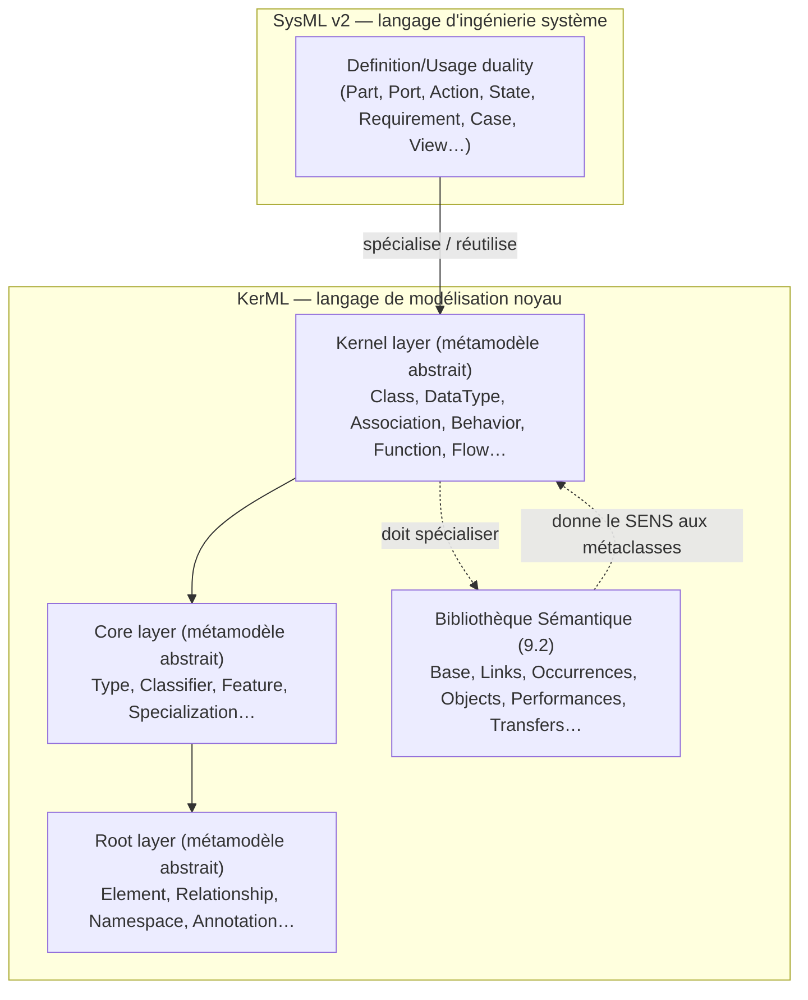
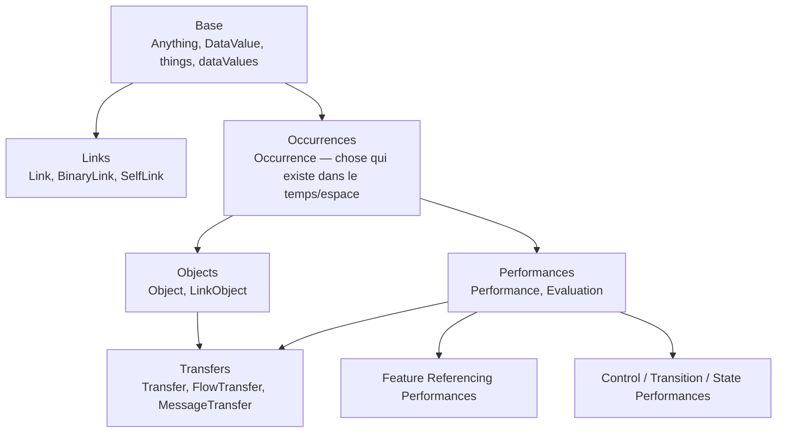
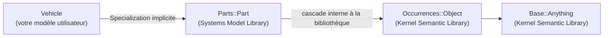
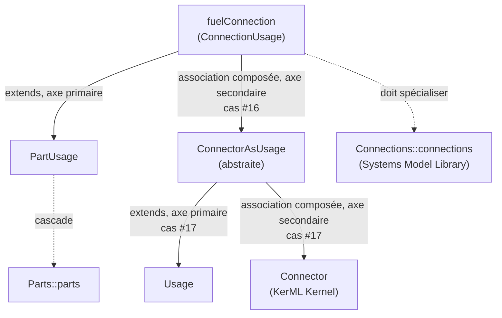

# KerML et SysML v2 — comprendre les deux métamodèles en détail

Document de référence conceptuel, complémentaire aux trois études de mapping déjà produites dans `SysMLv2/deck-implementation-plan/` :
- [spec-complete-greffe-sysml-modelio.md](../deck-implementation-plan/spec-complete-greffe-sysml-modelio.md) — points de greffe, 3 chevauchements, 34 cas d'héritage multiple, processus SemGen
- [etude-comparative-kerml-modelio.md](../deck-implementation-plan/etude-comparative-kerml-modelio.md) — passage classe par classe des couches Root/Core/Kernel de KerML face à Modelio
- [etude-comparative-sysml-modelio.md](../deck-implementation-plan/etude-comparative-sysml-modelio.md) — passage par domaine des concepts SysML v2 (Requirements, Ports, Cases, Views…) face à Modelio

**Objectif de ce document** : répondre à « qu'est-ce que KerML et SysML v2 contiennent réellement ? », indépendamment de Modelio — une explication conceptuelle du métamodèle lui-même, avec un développement approfondi de la **Bibliothèque Sémantique** de KerML (section `9.2` de la spec), qui n'était que mentionnée en une phrase dans l'étude KerML.

> **Point de vocabulaire important** : KerML et SysML v2 ont chacun **leur propre bibliothèque de modèles normative**, distincte mais empilée en cascade — la **Kernel Semantic Library** (KerML, détaillée en §3) et la **Systems Model Library** (SysML v2, détaillée en §4.3). Ce ne sont ni la même bibliothèque, ni deux bibliothèques indépendantes : chaque élément de la Systems Model Library spécialise, au bout de la chaîne, un élément de la Kernel Semantic Library (ex. `Parts::Part` spécialise en cascade `Base::Anything`).

---

## 1. Vue d'ensemble : deux couches empilées



**Point clé souvent sous-estimé** : KerML n'est pas *seulement* un métamodèle abstrait (les couches Root/Core/Kernel, qui définissent la syntaxe — quels attributs, quelles cardinalités). C'est un métamodèle **plus** une **bibliothèque de modèles de référence** (la Bibliothèque Sémantique) que chaque métaclasse concrète doit obligatoirement spécialiser pour avoir un sens précis. Sans elle, le métamodèle abstrait décrit juste une syntaxe vide de sens.

---

## 2. KerML — le métamodèle abstrait (rappel structuré)

### 2.1 Couche Root (`8.3.2`) — le socle absolu

| Domaine | Contenu | Rôle |
|---|---|---|
| Elements & Relationships | `Element`, `Relationship` | Racine de tout ; relation générique source/cible |
| Dependencies | `Dependency` | Relation de dépendance générique |
| Annotations | `AnnotatingElement`, `Comment`, `Documentation`, `TextualRepresentation` | Commentaires/documentation attachés à un ou plusieurs éléments |
| Namespaces & Packages | `Namespace`, `Membership`/`OwningMembership`, `Import`, `VisibilityKind` | Appartenance et visibilité des éléments (réifiées — cf. étude KerML, constat transversal 1) |

### 2.2 Couche Core (`8.3.3`) — le système de types

| Domaine | Contenu | Rôle |
|---|---|---|
| Types | `Type`, `Specialization`, `Conjugation`/`Unioning`/`Intersecting`/`Differencing`/`Disjoining`, `Multiplicity` | `Type` unifie `Classifier` **et** `Feature` sous un même ancêtre — particularité propre à KerML |
| Classifiers | `Classifier`, `Subclassification` | Ce qui classifie des choses |
| Features | `Feature`, `FeatureTyping`, `Redefinition`, `Subsetting`, `FeatureChaining`… | Caractéristiques structurelles/comportementales et leurs relations entre elles |

### 2.3 Couche Kernel (`8.3.4`) — les concepts de modélisation concrets

| Domaine | Contenu |
|---|---|
| Data Types / Classes / Structures | `DataType`, `Class`, `Structure` |
| Associations | `Association`, `AssociationStructure` |
| Connectors | `Connector`, `BindingConnector`, `Succession` |
| Behaviors | `Behavior`, `Step`, `ParameterMembership` |
| Functions / Expressions | `Function`, `Predicate`, `Invariant`, `BooleanExpression`, `Expression` + ~15 classes de littéraux/opérateurs |
| Interactions | `Interaction`, `Flow`, `FlowEnd`, `SuccessionFlow`, `PayloadFeature` |
| Feature Values / Multiplicities | `FeatureValue`, `MultiplicityRange` |
| Metadata | `Metaclass`, `MetadataFeature` |
| Packages | `Package`, `LibraryPackage`, `ElementFilterMembership` |

Ces trois couches sont **entièrement couvertes classe par classe** dans l'étude KerML référencée plus haut.

---

## 3. La Bibliothèque Sémantique de KerML (`9.2`) — développement approfondi

### 3.1 Pourquoi elle existe : donner un sens aux métaclasses abstraites

La spec KerML est explicite (`9.2.1`) :

> « The Semantic Library is a collection of KerML models that are part of the **semantics** of the metamodel. They are reused when constructing KerML user models, as specified by constraints […] such as Types being required to specialize `Anything` from the library and Behaviors specializing `Performance`. »

Concrètement, on a vu dans les deux études précédentes des dizaines de contraintes du type `specializesFromLibrary('Base::Anything')` ou `specializesFromLibrary('Performances::Performance')` — **chaque métaclasse concrète de KerML doit obligatoirement spécialiser, directement ou indirectement, un élément précis de cette bibliothèque**. Ce n'est donc pas une bibliothèque optionnelle d'exemples : c'est une **partie normative du métamodèle**, aussi obligatoire que les attributs eux-mêmes.

**Différence avec les deux autres bibliothèques standard** (`9.1`) : KerML définit trois bibliothèques — la **Semantic Library** (`9.2`, sémantique/comportementale), la **Data Type Library** (`9.3`, types de données primitifs comme `Integer`, `String`, `Boolean`) et la **Function Library** (`9.4`, fonctions mathématiques/logiques utilisables dans les `Expression`). Ce document ne détaille que la Semantic Library, la plus structurante.

### 3.2 Structure : 3 groupes de packages, en cascade de spécialisation

D'après l'overview (`9.2.1`), la bibliothèque se lit en 3 blocs qui se spécialisent successivement :



### 3.3 Détail package par package

#### `Base` (`9.2.2`) — le sommet de toute hiérarchie de types

Contient les éléments **les plus généraux possibles**, que absolument tout doit spécialiser :

| Élément | Type KerML | Rôle |
|---|---|---|
| `Anything` | `Classifier` | Le `Classifier` le plus général qui soit — **tout** `Element` de n'importe quel modèle (bibliothèque ou utilisateur) le spécialise directement ou indirectement. C'est la racine absolue de la classification. |
| `things` | `Feature` | La `Feature` la plus générale — typée par `Anything`. Toute `Feature` d'un modèle la spécialise. |
| `DataValue` | `DataType` | Le `DataType` le plus général — « une chose qu'on ne peut distinguer que par ses relations à d'autres choses ». |
| `dataValues` | `Feature` | Spécialisation de `things` restreinte au type `DataValue`. |
| `Natural`/`naturals` | — | Les entiers naturels (0, 1, 2… et l'infini noté `*`) — base de toutes les `Multiplicity`. |
| `exactlyOne`, `oneToMany`, `zeroOrOne`, `zeroToMany` | `MultiplicityRange` | Les bornes de cardinalité **prêtes à l'emploi** les plus courantes — ce sont littéralement les `[1..1]`, `[1..*]`, `[0..1]`, `[0..*]` qu'on voit partout dans les specs KerML/SysML, réifiées comme de vrais éléments de bibliothèque réutilisables plutôt que de simples notations. |

#### `Links` (`9.2.3`) — la sémantique des associations

| Élément | Rôle |
|---|---|
| `Link` | L'`Association` la plus générale — tout lien entre choses en dérive. |
| `BinaryLink` | `Link` à exactement 2 `associationEnd` (`source`/`target`) — la très grande majorité des associations réelles sont binaires. |
| `SelfLink`/`selfLinks` | Cas particulier où source = target — **c'est la base sémantique des `BindingConnector`** (deux Features qui doivent avoir la même valeur, donc « pointer vers la même chose »). |

#### `Occurrences` (`9.2.4`) — le concept le plus fondamental après `Anything`

C'est le package le plus dense et le plus original de KerML (aucun équivalent dans les métamodèles UML classiques, cf. étude KerML/SysML). `Occurrence` est **la chose la plus générale qui existe ou se produit dans le temps et l'espace** — la classe (`Class`) la plus générale de tout KerML.

**Concepts clés introduits ici** :
- **Portions et tranches temporelles** : toute `Occurrence` peut être découpée en `timeSlices` (tranches dans le temps) et `spaceSlices` (tranches dans l'espace). Une `snapShot` est une tranche instantanée (durée nulle) — la première s'appelle `startShot`, la dernière `endShot`.
- **Relations temporelles réifiées** : `HappensBefore` (se produit avant), `HappensDuring` (se produit pendant), `HappensWhile` (exactement en même temps) — ce sont ces associations qui donnent tout son sens sémantique à `Succession` (KerML) et donc, en cascade, à tous les diagrammes de séquence/flux de SysML v2.
- **Relations spatiales réifiées** : `OutsideOf`, `InsideOf`, `SurroundedBy`, `MatesWith` — un modèle géométrique complet de « qui est dans/hors de/à côté de qui » dans l'espace.

**Pourquoi c'est important à comprendre** : quand la spec dit qu'un `Connector` ou une `Succession` doit « spécialiser `Occurrences::happensBeforeLinks` », ce n'est pas une formalité administrative — ça veut dire que l'élément **hérite réellement de toute cette sémantique temporelle** (ordre, exclusion mutuelle dans le temps, etc.). C'est ce moteur sémantique qui, en toute rigueur, devrait être respecté par toute implémentation qui prétend être fidèle à KerML — et c'est très exactement le genre de comportement qui n'a **aucun équivalent** dans Modelio (cf. étude KerML, absence totale de mécanisme temporel/spatial réifié dans le métamodèle UML classique).

#### `Objects` (`9.2.5`) — spécialise Occurrences pour les « choses »

- `Object` : l'`Occurrence` qui n'est pas une `Performance` — la `Structure` la plus générale. Correspond exactement à l'usage réel de `Structure` en KerML (§C.1 de l'étude KerML).
- `LinkObject`/`BinaryLinkObject` : `Object` qui est *aussi* un `Link` — c'est la base sémantique d'`AssociationStructure` (déjà étudiée, cas #2/#15).
- Contient aussi tout un sous-modèle géométrique (`Body`, `Surface`, `Curve`, `Point`, `StructuredSpaceObject`) pour représenter des formes dans l'espace — clairement héritée d'une ambition de modélisation physique/géométrique des systèmes, assez éloignée des préoccupations de gestion de projet logiciel Modelio.

#### `Performances` (`9.2.6`) — spécialise Occurrences pour les comportements

- `Performance` : l'`Occurrence` qui n'est pas un `Object` — le `Behavior` le plus général. Peut avoir des `performers` (les `Object` qui l'exécutent) et des `involvedObjects`.
- `Evaluation` : une `Performance` qui produit au plus un résultat — le `Function` le plus général.
- `BooleanEvaluation`/`trueEvaluations`/`falseEvaluations` : base sémantique exacte d'`Invariant` (déjà étudié, cas #10/#32) — `isNegated=false` spécialise `trueEvaluations`, `isNegated=true` spécialise `falseEvaluations`.
- `LiteralEvaluation`, `NullEvaluation`, `MetadataAccessEvaluation` : bases sémantiques des différentes classes concrètes d'`Expression` déjà groupées comme « famille sans équivalent Modelio » dans l'étude KerML (§C.5).

#### `Transfers` (`9.2.7`) — la sémantique des flux

- `Transfer` : `Performance` **et** `BinaryLink` en même temps — porte un `payload` d'une source vers une cible.
- `FlowTransfer` : `Transfer` qui précise *où* le contenu est pris (feature de sortie de la source) et *où* il est déposé (feature d'entrée de la cible) — base sémantique exacte de `Flow` (déjà étudié, cas #4/#7/#21/#22/#34).
- `MessageTransfer` : `Transfer` sans ce niveau de précision — utilisé par `SendPerformance`/`AcceptPerformance` pour les échanges de messages asynchrones.

**Ce package confirme quelque chose d'important pour le projet** : la sémantique complète de `Flow` (déjà source de 5 des 34 cas d'héritage multiple) inclut des notions comme `isMove`/`isPush` (le transfert déplace-t-il ou copie-t-il le payload ? commence-t-il dès que le payload est disponible ?) qui ne sont mentionnées nulle part dans les 34 résolutions déjà actées — un point à vérifier si l'implémentation doit refléter ce niveau de détail comportemental, ou si on s'arrête à la structure (position déjà cohérente avec le principe de non-conformité à 100 %, Partie 0 de la spec principale).

### 3.4 Packages complémentaires (non détaillés dans cette passe)

La bibliothèque continue au-delà de ce qui est détaillé ci-dessus, avec des packages plus spécialisés, listés ici pour mémoire (non étudiés en profondeur, car moins susceptibles d'impacter directement le périmètre déjà tranché) :

| Package | Rôle résumé |
|---|---|
| `9.2.8` Feature Referencing Performances | Accès/modification de la valeur d'une feature à un instant précis |
| `9.2.9` Control Performances | Coordination de plusieurs `Performance` (base sémantique pour ce qui deviendra les nœuds de contrôle d'activité) |
| `9.2.10` Transition Performances | Base sémantique des transitions (préfigure les machines à état) |
| `9.2.11` State Performances | Base sémantique des états |
| `9.2.12` Clocks | Modèle d'horloges/temps physique |
| `9.2.13` Observation | Modèle d'observation d'événements |
| `9.2.14` Triggers | Déclencheurs |
| `9.2.15` SpatialFrames | Repères spatiaux |
| `9.2.16` Metaobjects | Base sémantique de `Metaclass`/`MetadataFeature` (`Metaobjects::Metaobject`, `Metaobjects::SemanticMetadata` — déjà cités dans la spec principale, Partie 2.3) |

**Remarque explicite de la spec, très pertinente pour ce projet** : « KerML ne fournit pas de syntaxe spécifique pour Control/Transition/State Performances (ex. pas de syntaxe de "nœud de contrôle" ou de "machine à état" en KerML) — mais il est prévu que d'autres langages construits sur KerML, comme SysML v2, ajoutent leur propre syntaxe en réutilisant ces modèles de bibliothèque. » C'est exactement ce que fait SysML v2 avec ses domaines `Actions` (`8.3.17`) et `States` (`8.3.18`) — la confirmation que ces deux domaines SysML v2 sont sémantiquement fondés sur ces packages de bibliothèque, même si nos études n'ont pas encore creusé ce niveau de détail (cf. étude SysML, section « Priorité 4, non traité »).

---

## 4. SysML v2 — vocabulaire d'ingénierie système

### 4.1 Le patron central : la dualité Definition/Usage (`8.3.6`)

Chaque domaine métier SysML v2 définit une paire :
- **`XxxDefinition`** : le type/gabarit réutilisable (« qu'est-ce qu'une pompe ? »)
- **`XxxUsage`** : une occurrence typée par une `Definition`, dans un contexte précis (« cette pompe-ci, dans ce sous-système-là »)

`Definition` spécialise en cascade `Type`/`Classifier` (KerML), `Usage` spécialise en cascade `Type`/`Feature` (KerML) — c'est ce qui explique pourquoi la dualité Definition/Usage de SysML v2 est le pendant direct, au niveau métier, de l'unification `Type` = `Classifier` ∪ `Feature` déjà identifiée comme particularité de KerML (§2.2 ci-dessus).

### 4.2 La Systems Model Library — la bibliothèque normative propre à SysML v2 (`9.2` de `sysml.txt`)

Exactement comme KerML impose `specializesFromLibrary('Base::Anything')` à ses métaclasses abstraites, SysML v2 impose à chacune de ses `Definition`/`Usage` de spécialiser une base précise de sa **propre** bibliothèque — la **Systems Model Library** — qui elle-même spécialise en cascade la Kernel Semantic Library de KerML :

> « The Systems Model Library, **which is based on the KerML Kernel Semantic Library**, [...] a part definition must specialize the base part definition `Part` from the [Systems Model Library] [...] Anything from the Base model in the Kernel Semantic Library. » (sysml.txt, `9.2.1`)

**Un package par domaine métier**, en miroir direct des domaines de la spec elle-même : `Attributes`, `Items`, `Parts` (`Parts::Part`), `Ports` (`Ports::Port`), `Connections`, `Interfaces`, `Allocations`, `Flows`, `Actions` (avec le détail des actions de contrôle concrètes : `IfThenAction`, `ForLoopAction`, `WhileLoopAction`, `DecisionAction`, `ForkAction`, `JoinAction`, `MergeAction`…), `States`, `Calculations`, `Constraints`, `Requirements` (avec les checks par catégorie : `FunctionalRequirementCheck`, `PerformanceRequirementCheck`, `InterfaceRequirementCheck`, `PhysicalRequirementCheck`, `DesignConstraintCheck`), `Cases`, `AnalysisCases`, `VerificationCases` (avec `VerdictKind`, `VerificationMethodKind`, `PassIf`), `UseCases`, `Views` (avec les rendus concrets `TabularRendering`/`TextualRendering`/`GraphicalRendering`), `StandardViewDefinitions` (vues prêtes à l'emploi : `ActionFlowView`, `SequenceView`, `StateTransitionView`, `InterconnectionView`…), `Metadata`, et un package `SysML` (`9.2.22`) qui contient le modèle complet de SysML v2 lui-même (auto-référence).

**Domain Libraries optionnelles (`9.3`-`9.8`, non obligatoires pour un outil conforme)** : au-delà de la Systems Model Library « cœur », la spec propose des bibliothèques complémentaires non normatives — `Metadata Domain Library` (`Issue`, `Rationale`, `Risk`, `Icon`, `StatusInfo`…), `Analysis Domain Library`, `Cause and Effect Domain Library`, `Requirement Derivation Domain Library`, `Quantities and Units Domain Library`. Aucune n'a encore été étudiée face à Modelio.

### 4.3 Les domaines, dans l'ordre de la spec

| # | Domaine | Concepts clés | Étudié dans |
|---|---|---|---|
| 8.3.7-8.3.9 | Attributes, Enumerations, Occurrences | `AttributeDefinition/Usage`, `EnumerationDefinition/Usage`, `OccurrenceDefinition/Usage` | Spec principale (cas #8-34) |
| 8.3.10-8.3.11 | Items, Parts | `ItemDefinition/Usage`, `PartDefinition/Usage` | Spec principale + étude SysML |
| 8.3.12 | Ports | `PortDefinition/Usage`, conjugaison de ports | Étude SysML |
| 8.3.13-8.3.14 | Connections, Interfaces | `ConnectionDefinition/Usage`, `InterfaceDefinition/Usage` (🔀 faux ami Modelio) | Étude SysML |
| 8.3.15 | Allocations | `AllocationDefinition/Usage` | Étude SysML |
| 8.3.16 | Flow | `FlowDefinition/Usage`, `SuccessionFlowUsage` | Spec principale + §3.3 ci-dessus (Transfers) |
| 8.3.17-8.3.18 | Actions, States | Comportemental, fondé sur Control/Transition/State Performances (§3.4) | Partiellement couvert, reste à approfondir |
| 8.3.19-8.3.20 | Calculations, Constraints | `CalculationDefinition/Usage`, `ConstraintDefinition/Usage` | Spec principale (cas #13,14,18,19) |
| 8.3.21 | Requirements | `RequirementDefinition/Usage`, `ConcernUsage` | Étude SysML |
| 8.3.22-8.3.25 | Cases (Analysis/Verification/UseCase) | `CaseDefinition/Usage` et spécialisations | Étude SysML |
| 8.3.26 | Views and Viewpoints | `ViewDefinition/Usage`, `Expose` | Étude SysML |
| 8.3.27 | Metadata | `MetadataDefinition/Usage` | Spec principale (Partie 2.3) |

---

## 5. Exemple complet fil rouge — un véhicule et son moteur

Un modèle SysML v2 minimal, pour tracer concrètement ce que chaque ligne déclenche dans les 4 niveaux déjà présentés (métamodèle SysML → bibliothèque SysML → bibliothèque KerML → métamodèle KerML).

```sysml
part def Vehicle {
    part engine : Engine;
    port fuelPort : FuelPort;
    doc /* Véhicule routier standard */
}

part def Engine {
    attribute power : Real;
}

port def FuelPort;

requirement def MaxSpeedRequirement {
    doc /* Le véhicule ne doit pas dépasser 200 km/h */
    attribute maxSpeed : Real;
}
```

### 5.1 `part def Vehicle` — le cas le plus riche, à suivre pas à pas

| Niveau | Ce qui est réellement créé/exigé |
|---|---|
| **Métamodèle SysML** (`8.3.11`) | Une instance de `PartDefinition` — qui, en cascade d'héritage SysML, est aussi une `ItemDefinition`, une `OccurrenceDefinition`, une `Definition` |
| **Métamodèle KerML** (`8.3.4.2`/`8.3.3.2`) | `OccurrenceDefinition extends Definition implements Class` (cas #29 des 34 résolutions) — donc `Vehicle` est *aussi*, structurellement, une `Class` KerML |
| **Bibliothèque SysML** (`9.2.4` Parts) | Contrainte normative : `Vehicle` doit **spécialiser** `Parts::Part`. Ce n'est pas automatique — le parseur/l'outil doit soit trouver une spécialisation explicite écrite par l'utilisateur, soit **insérer lui-même une `Specialization` implicite** vers `Parts::Part` (mécanisme documenté en KerML `8.4` — « a tool may insert certain implied Relationships ») |
| **Bibliothèque KerML** (`9.2.5` Objects) | `Parts::Part` spécialise à son tour (en cascade, dans la bibliothèque SysML elle-même) jusqu'à atteindre `Occurrences::Object`, puis `Base::Anything` (Kernel Semantic Library) |



**Ce que ça signifie concrètement** : si demain le mécanisme `specializesFromLibrary('Parts::Part')` n'est pas satisfait (parce que la bibliothèque `Parts` n'existe pas dans le projet Modelio, cf. Partie 4.5 de la spec principale), **`Vehicle` n'est tout simplement pas un modèle SysML v2 valide** — même si sa classe Java `PartDefinitionImpl` fonctionne parfaitement. C'est la démonstration concrète de « pourquoi c'est obligatoire ».

### 5.2 `part engine : Engine` — une `Usage`, pas une `Definition`

| Niveau | Ce qui est créé |
|---|---|
| Métamodèle SysML | `PartUsage`, **typé par** `Engine` (qui est lui-même un `PartDefinition` séparé, avec son propre attribut `power`) |
| Bibliothèque SysML | Doit spécialiser `Parts::parts` (la **Feature** de base, pendant de `Parts::Part` côté `Usage` — rappel §4.1 : chaque `Definition` de bibliothèque a sa `Usage` parallèle) |
| Bibliothèque KerML | `Parts::parts` spécialise en cascade `things` (`Base`, KerML) — la Feature la plus générale de tout KerML |

**Point pédagogique** : `Vehicle` (Definition → chaîne vers `Anything`) et `engine` (Usage → chaîne vers `things`) suivent **deux chaînes parallèles différentes**, exactement comme annoncé en §4.1 — c'est la dualité Definition/Usage qui se prolonge jusque dans la bibliothèque elle-même, pas seulement dans le métamodèle.

### 5.3 `port fuelPort : FuelPort` — même patron, avec la conjugaison en embuscade

`FuelPort` (un `PortDefinition`) génère **automatiquement** un second élément invisible dans le code source mais bien réel dans le modèle : `~FuelPort` (son `ConjugatedPortDefinition`), via une relation `PortConjugation` (spécialisation de `Conjugation` — cf. étude SysML, section Ports, ❌ aucun équivalent Modelio identifié à ce jour). `fuelPort` doit par ailleurs spécialiser `Ports::ports` (Systems Model Library), qui rejoint la même cascade que `parts` ci-dessus.

### 5.4 `doc /* Véhicule routier standard */` — un concept Root, pas de bibliothèque impliquée

Contrairement aux trois cas précédents, `Documentation` (KerML Root, `8.3.2.3.5`) **n'a pas de contrainte `specializesFromLibrary`** — c'est un concept de la couche Root de KerML, réutilisé tel quel par SysML v2 sans redéfinition ni base de bibliothèque dédiée. **Ce cas illustre que tous les concepts ne passent pas par une bibliothèque** — seuls les `Classifier`/`Feature` concrets du niveau Kernel/SysML (les choses qu'on peut « classifier » ou « typer ») sont soumis à cette obligation ; les mécanismes structurels de bas niveau (`Element`, `Relationship`, `Annotation`) n'en ont pas besoin, car ils ne « classifient » rien.

### 5.5 `attribute power : Real` — la Multiplicité, concrètement

`power : Real` a par défaut une multiplicité `[1..1]` (une seule valeur). Cette multiplicité n'est pas un simple couple d'entiers stockés à plat : c'est une instance de `MultiplicityRange` (KerML Kernel, `8.3.4.11.2`) qui doit elle-même spécialiser l'élément de bibliothèque **prêt à l'emploi** `Base::exactlyOne` (Kernel Semantic Library, §3.3 ci-dessus) — exactement le même élément que celui utilisé, par exemple, par la spec elle-même pour dire que `Function.result` a une multiplicité de 1. **C'est un exemple concret de réutilisation de bibliothèque qui ne passe pas par SysML** : `exactlyOne` est un élément KerML pur, utilisé directement, sans intermédiaire SysML.

### 5.6 `requirement def MaxSpeedRequirement` — la chaîne la plus longue

| Niveau | Ce qui est créé |
|---|---|
| Métamodèle SysML | `RequirementDefinition` → en cascade `ConstraintDefinition` → `OccurrenceDefinition` → `Definition` |
| Métamodèle KerML | `ConstraintDefinition implements Predicate` (cas #18) |
| Bibliothèque SysML | Doit spécialiser `Requirements::RequirementCheck` (§4.2 ci-dessus), qui spécialise à son tour en cascade `Constraints::ConstraintCheck` |
| Bibliothèque KerML | `ConstraintCheck` rejoint finalement `Performances::BooleanEvaluation` puis `Performances::Evaluation` (§3.3 ci-dessus) — la sémantique exacte qui permet, en théorie, d'évaluer si l'exigence est satisfaite ou non |

**Pourquoi c'est la chaîne la plus longue de l'exemple** : une exigence n'est pas qu'un texte descriptif — au sens strict de la spec, c'est une **contrainte évaluable**, avec toute la sémantique de `Performances::Evaluation` (résultat, paramètres, évaluation) derrière. C'est cohérent avec l'écart déjà documenté dans l'étude SysML (famille `Expression`/`Invariant`/`Predicate` ❌ sans équivalent Modelio) — et cet exemple montre concrètement *où* cette lacune se manifeste : dès qu'on écrit une exigence, en toute rigueur KerML/SysML v2, on écrit implicitement une contrainte booléenne évaluable, pas juste un champ de texte libre.

### 5.7 Ce que cet exemple révèle en une phrase par élément

| Élément du modèle | Chaîne de spécialisation (résumée) |
|---|---|
| `Vehicle` | `Vehicle` → `Parts::Part` → `Occurrences::Object` → `Base::Anything` |
| `engine` | `engine` → `Parts::parts` → `Base::things` |
| `fuelPort` | `fuelPort` → `Ports::ports` → `Base::things` (+ génère `~FuelPort` via `Conjugation`, hors bibliothèque) |
| `doc /* ... */` | Aucune bibliothèque — concept Root KerML pur |
| `power : Real` | Sa multiplicité `[1..1]` → `Base::exactlyOne` |
| `MaxSpeedRequirement` | `MaxSpeedRequirement` → `Requirements::RequirementCheck` → `Constraints::ConstraintCheck` → `Performances::BooleanEvaluation` |

### 5.8 `connection fuelConnection` — relier les deux ports, avec deux axes d'héritage

Complément à l'exemple, en corrigeant deux erreurs courantes qu'on trouve dans des explications informelles trouvées en ligne (mauvaise syntaxe concrète, hiérarchie simplifiée à l'excès) :

```sysml
part def Vehicle {
    part engine : Engine;
    port fuelPort : FuelPort;
    connection fuelConnection connect fuelPort to engine.fuelInput;
}
```

**Syntaxe concrète réelle** (spec `8.2.2.13.1`, `ConnectionUsage`) : le mot-clé normatif est **`connect ... to ...`**, pas `source = / target =` — cette dernière forme n'existe pas dans la grammaire SysML v2.

**`fuelConnection` est bien une `Usage`, pas une `Definition`** : l'absence du mot-clé `def` après `connection` en fait une occurrence propre au contexte de `Vehicle`, pas un type réutilisable (qui s'écrirait `connection def MaFuelConnection { ... }`).

**Hiérarchie précise — deux axes, pas une chaîne linéaire** (à aligner sur les cas #16/#17 déjà actés dans la spec principale, Partie 3.3, pas sur une simplification) :



**`ConnectorAsUsage` a 4 sous-classes sœurs concrètes, pas des « modes » d'un `Connector`** (spec `8.3.13.5`) : `BindingConnectorAsUsage` (mot-clé `bind`, égalité de valeurs), `SuccessionAsUsage` (mot-clé `first`/`then`, ordre temporel), `ConnectionUsage` (mot-clé `connect`, connexion générale — notre cas), `FlowConnectionUsage` (mot-clé `flow`, transfert de payload — **pas** « `FlowConnection` »). Ce sont 4 spécialisations indépendantes, chacune avec sa propre syntaxe concrète, pas un choix conditionnel au sein d'une seule classe `Connector`.

**Bibliothèque** : `fuelConnection` doit spécialiser `Connections::connections` (Systems Model Library, `9.2.6.2.4`, déjà identifié en §4.3) — vérifié directement dans la spec. Le prolongement exact de cette cascade jusqu'à `Base::Anything`/`Links::Link` (Kernel Semantic Library) n'a pas encore été vérifié ligne par ligne dans nos études — à confirmer avant de l'affirmer comme fait, plutôt que de l'inventer par analogie.

---

## 6. En résumé

| Question | Réponse courte |
|---|---|
| Que contient KerML ? | Un métamodèle abstrait en 3 couches (Root/Core/Kernel) **+** une Bibliothèque Sémantique normative (Base, Links, Occurrences, Objects, Performances, Transfers…) que chaque métaclasse doit spécialiser pour avoir un sens |
| Que contient SysML v2 ? | Un vocabulaire d'ingénierie système organisé en ~20 domaines métier, structuré systématiquement par la dualité `Definition`/`Usage`, entièrement bâti par spécialisation de KerML |
| Pourquoi la Bibliothèque Sémantique compte pour ce projet | Elle explique le *pourquoi* de contraintes déjà rencontrées (`specializesFromLibrary`), et révèle des comportements fins (temporalité d'`Occurrence`, `isMove`/`isPush` de `Flow`) non encore pris en compte dans les 34 cas d'héritage multiple ni dans les deux études de mapping — piste à vérifier avant de considérer le mapping structurel comme suffisant |
